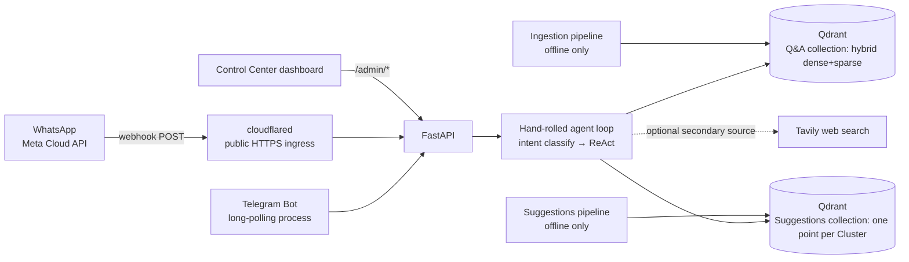

# Habitantes de Grenoble — AI Chatbot

An AI-powered assistant that helps Brazilian expats in Grenoble navigate daily life, bureaucracy, and housing. The bot leverages years of community knowledge from WhatsApp groups to provide instant, reliable, grounded answers in Portuguese.

It draws on two knowledge bases built offline from the same group export:

- **Q&A knowledge base** — Q&A Pairs (a question and the answers it received), for "how do I...?" questions.
- **Suggestions** — businesses, places and products the community recommends (dentists, hairdressers, markets, shops...), consolidated from opinions found anywhere in the chat, for "who/where do you recommend for...?" requests. See [Suggestions](#suggestions-community-recommendations).

Vocabulary used across the docs (Thread, Q&A Pair, Suggestion, Kind, Mention, Cluster, Community Business...) is defined in [CONTEXT.md](CONTEXT.md).

---

## Architecture



- **Orchestration**: no LangGraph — a hand-rolled two-layer loop in `api/src/habitantes/domain/agent.py`:
  1. `_classify_intent` — a numeric category shortcut (typed "1".."19"), or an LLM call forced (via OpenAI-style tool-calling) to return `greeting | qa | recommendation | both | feedback | out_of_scope`. `qa` is a procedural question, `recommendation` a request for who/where to go to, `both` a message that is genuinely both.
  2. `_run_react_loop` — an LLM + tool-calling loop (up to `agent.max_react_iterations` rounds) and synthesis of the final answer. The tools are chosen **from the classified intent**, not by the model ([ADR 0001](docs/adr/0001-tools-chosen-from-classified-intent.md)): `qa` binds the knowledge-base tools (`search_knowledge_base`, `list_knowledge_subcategories`, `get_chunks_by_category`), `recommendation` binds `search_suggestions`, `both` binds both sets, and `web_search_grenoble` is added in every tool-using case when web search is enabled and keyed. `greeting`, `feedback` and `out_of_scope` bind no tools.
  Short-term memory is a plain in-process `dict` keyed by `chat_id` (`_memory` in `agent.py`), capped at `agent.max_history` turns — it is **not** persisted and resets on process restart.
- **Backend**: FastAPI (`api/src/habitantes/infrastructure/api/`)
- **Vector store**: Qdrant, two independent collections.
  - Q&A (`habitantes_qa_chat_kb`): hybrid search — dense (OpenAI `text-embedding-3-small`, 1536‑d) + sparse (`Qdrant/bm25` via `fastembed`), fused with a weighted RRF, then date-decay + anchor rerank + thread-level dedup.
  - Suggestions (`habitantes_suggestions_kb`, `suggestions.collection_name`): one point per Cluster; `search_suggestions` runs a hybrid query (dense with its own relevance floor `suggestions.min_relevance`, plus the sparse keyword vector, fused with RRF).
- **Channels**:
  - **Telegram** (`app/telegram_bot.py`) — a separate long-polling process, calls the API over HTTP.
  - **WhatsApp** (official Meta Cloud API) — **not** a separate bot process. It's a webhook handled inside the FastAPI process itself (`infrastructure/whatsapp/{client,processor,guards}.py`, wired via `routers/webhooks.py`), fronted by a `cloudflared` container that gives the homelab a public HTTPS endpoint for Meta to POST to. See [docs/WHATSAPP_CLOUD_SETUP.md](docs/WHATSAPP_CLOUD_SETUP.md) for the manual Meta-panel setup.
- **Web search**: Tavily, an optional secondary source scoped to Grenoble, available to every tool-using intent and used as the fallback when the knowledge bases (including Suggestions) have no answer — see `docs/ARCHITECTURE.md` for its limitations.
- **Control Center**: a token-gated admin dashboard (`app/admin/`, static HTML served at `/admin/ui`) plus `/admin/*` API routes — kill switch, cost/usage KPIs, health status, alert log. No extra container; it lives inside the `api` service.
- **Config**: `config/base.yaml` + `.env` secrets + `APP_ENV` environment selector (`dev` / `prod`)

---

## Prerequisites

- Python `>=3.10` (per `pyproject.toml`'s `requires-python`; CI itself runs 3.12)
- Docker & Docker Compose
- `uv` (recommended) or `pip`
- API keys/tokens for the services below — see [Configure secrets](#2-configure-secrets)

---

## Setup

### 1. Install dependencies

```bash
uv sync                 # runtime dependencies only
uv sync --extra dev     # add test tooling (pytest, pytest-asyncio)
```

`make install` runs the `--extra dev` sync for you.

Linting/formatting is **ruff** (`ruff` + `ruff-format`), run through `pre-commit` (`make lint-format` / `make setup-hooks`) — it is not one of the `--extra dev` packages, `pre-commit` pulls it into its own managed environment.

### 2. Configure secrets

```bash
cp .env.example .env
```

The API **will not start** unless these are set (Pydantic validates them at startup and raises `RuntimeError: Missing required configuration: ...` otherwise — see `config.py`'s `load_settings()`):

```bash
OPENROUTER_API_KEY=sk-or-...   # chat/completions (agent, ingestion synthesis, eval judge)
OPENAI_API_KEY=sk-...          # embeddings only (text-embedding-3-small)
ADMIN_TOKEN=...                # shared secret for the Control Center's /admin/* routes
```

The Telegram bot process (`app/telegram_bot.py`, run separately from the API) additionally requires:

```bash
TELEGRAM_BOT_TOKEN=...         # from @BotFather — the bot process exits immediately without it
```

Everything else in `.env.example` is optional and only enables a specific feature when set (web search, the WhatsApp Cloud API channel, the Cloudflare tunnel, email alerts) — see the [full reference table](#environment-variables-reference) below.

`APP_ENV` defaults to `dev` — only set it explicitly if you want `prod`.

---

## Running the project

All commands go through `make`. The `ENV` variable controls which environment config is loaded from `config/base.yaml`.

### Environments

| Command | Effect |
|---|---|
| `make up` | Start all services in **dev** mode (default) |
| `make up ENV=prod` | Start all services in **prod** mode |
| `make build` | Build Docker images (dev) |
| `make build ENV=prod` | Build Docker images (prod) |
| `make down` | Stop all services |
| `make logs` | Follow live logs from all containers |

What changes between environments (see the `environments:` block in `config/base.yaml`):

| Setting | `dev` | `prod` |
|---|---|---|
| `api.log_level` | `DEBUG` | `WARNING` |
| `vector_store.collection_name` | `habitantes_qa_chat_kb` | `habitantes_qa_chat_kb` |

To add more per-environment overrides, edit the `environments:` block in [config/base.yaml](config/base.yaml).

---

## Data ingestion

Ingestion is **offline only** — never runs at query time. It parses raw WhatsApp exports and builds two knowledge bases in Qdrant from them: the Q&A one (synthesized Q&A Pairs, below) and the Suggestions one ([next section](#suggestions-community-recommendations)). The two pipelines share parsing and Thread splitting but write to separate collections and never touch each other's data.

### Step 1 — Place the raw data

The pipeline reads whatever filename is configured in `config/base.yaml`'s `ingestion.input_file` (currently `chat-21022026-18072026.txt`):

```
data/chat-21022026-18072026.txt   ← WhatsApp export file
```

Update `ingestion.input_file` in `config/base.yaml` if you're loading a different export.

### Step 2 — Full pipeline (parse → synthesize → load)

Runs all stages end-to-end and writes artifacts to `artifacts/<chat-stem>/`.

```bash
make ingest
```

### Step 3 — Load only (skip re-synthesis)

If synthesis artifacts already exist and you only need to re-index into Qdrant (e.g. after recreating the collection):

```bash
make load-only
```

Use `load-only` when:
- You dropped and recreated the Qdrant collection
- You changed embedding parameters and need to re-upsert existing vectors
- The LLM synthesis step is already done and you don't want to re-run it

---

## Suggestions (community recommendations)

The Q&A pipeline only sees messages the parser labels as questions that received answers, so most unprompted opinions ("fui no X e gostei", "super recomendo Y") never reach it. The Suggestions pipeline runs in parallel, finds those opinions anywhere in the chat, and stores the community's picks in its own Qdrant collection, queried by the `search_suggestions` tool. The Q&A pipeline, its message classification and its collection are unchanged.

### Pipeline

```
chat export -> shared parse + Thread split -> candidate windows (keyword lexicon)
  -> Jev yes/no filter per window -> pseudonymised LLM extraction -> mentions.jsonl
  -> opt-out list + name merge per Kind -> suggestions.jsonl
  -> Clusters per Kind (similarity), ranking, label + summary -> Qdrant (one point per Cluster)
```

1. **Windows** (`ingestion/suggestions/windows.py`): a broad lexicon (request phrases, pointers to places, first-person opinions, map/social/booking links, recommendation words, negative phrases) marks trigger messages regardless of their question/answer label. Each trigger opens a window (`window_before` messages before; `window_after_request` after a request, `window_after_other` after anything else). Overlapping windows are merged and a window never crosses a Thread boundary.
2. **Jev filter**: Jev (same OpenRouter mechanism as the Q&A gate) answers one yes/no question per window — "does this contain a Suggestion?" — with `jev_cutoff` as the P(yes) floor. A window Jev cannot classify is not extracted.
3. **Extraction** (`extract.py`): authors are replaced by pseudonyms (M1, M2...) and phone numbers scrubbed before any text reaches the LLM. The structured output is a Mention: name, Kind, polarity, Items, Context, date, Community Business flag. Consecutive messages by one person about one place are one Mention. Private individuals, banks, phone operators, apps, associations, public services and one-off events are dropped. Output (`artifacts/<chat>/mentions.jsonl`) has no author or phone field.
4. **Merge** (`merge.py`, `exclusions.py`): names are normalised in code (case, accents, punctuation, generic words), the opt-out list is applied, then one LLM pass per Kind maps variants to one canonical name (a chain is one Suggestion whichever branch is named). Counting happens only afterwards. Result: `artifacts/<chat>/suggestions.jsonl` (author-free).
5. **Clusters** (`clusters.py`): within a Kind, Mentions are grouped by similarity of Items and Context (`similarity_cutoff`, no fixed number of groups), so one Suggestion can sit in two Clusters. Repeated Mentions of a Suggestion collapse to one member line (👍/👎 counts, last date, Items). A Community Business advertiser's own post is stored but not counted, so it only appears with at least one Mention from another member.
6. **Rank and summarise**: +1 per 👍, -1 per 👎, Mentions older than `ranking_half_life_years` count half, ties to the most recent. Members scoring 0 or less are left out of the summary; the top `summary_size` are named, with "+K outras" for the rest. An LLM writes the Cluster label and one reworded line per member. Every member stays in the stored payload.
7. **Load** (`ingestion/load/suggestions.py`): the Suggestions collection is deleted and recreated on each run (only that collection; the Q&A one is never touched). Dense vector = summary plus every member's Items; sparse vector = Items plus every member name. Payload: Topic, Kind, label, totals, last date, members, summary — no author data. Topic is derived from Kind, never extracted (Restaurants & Bars and Markets & Groceries -> Food & Restaurants; Doctors and Dentists -> Health & Insurance; Translators -> Documents & Bureaucracy; and so on, see `api/src/habitantes/domain/suggestions.py`).

### Running it

```bash
make mentions      # parse + classify, then windows -> Jev -> extraction -> mentions.jsonl (needs OPENROUTER_API_KEY)
make suggestions   # merge -> opt-out -> Clusters -> rebuild the Suggestions collection (needs Qdrant, OPENROUTER_API_KEY, OPENAI_API_KEY)
```

`make mentions` is the expensive step (Jev and extraction LLM calls per window); `make suggestions` rebuilds from `mentions.jsonl` without the chat. Qdrant must be running (`docker compose up -d qdrant`). Run `make ingest` separately for the Q&A collection. The pipeline script also accepts `--stage mentions|suggestions|all`.

### Evaluating extraction

`make labelling-sample` draws about 50 random Threads for hand-labelling and `make labelling-measure` reports window coverage, recall and wrong extractions per Kind. The labelled sample has **not been produced yet**, so no extraction numbers or tuned window sizes exist; see [docs/SUGGESTIONS_EVAL.md](docs/SUGGESTIONS_EVAL.md). Answer-level evaluation (golden recommendation cases and the baseline-vs-feature comparison) is in [tests/eval/EVAL_GUIDE.md](tests/eval/EVAL_GUIDE.md); its real run is also pending.

### Configuration

The `suggestions:` section of [config/base.yaml](config/base.yaml) is read by both ingestion and the API:

| Key | Default | Meaning |
|---|---|---|
| `collection_name` | `habitantes_suggestions_kb` | Suggestions Qdrant collection (independent of the Q&A one) |
| `window_before` | 5 | Messages before a trigger message |
| `window_after_request` | 15 | Messages after a request trigger |
| `window_after_other` | 5 | Messages after any other trigger |
| `jev_cutoff` | 0.92 | Minimum Jev P(yes) for a window to be extracted |
| `similarity_cutoff` | 0.75 | Minimum Item/Context similarity for Mentions to share a Cluster |
| `ranking_half_life_years` | 2.0 | Mentions older than this count half |
| `summary_size` | 5 | Members named in a Cluster summary |
| `max_clusters` | 3 | Clusters returned by `search_suggestions` |
| `max_extra_members` | 3 | Extra query-matching members returned beyond the top ones |
| `min_relevance` | 0.55 | Dense cosine floor for `search_suggestions` hits (separate from `search.min_relevance`) |

The merge and label LLM calls reuse the ingestion model settings (`MentionExtractionConfig` defaults in `ingestion/config.py`: `mention_extraction` and `suggestion_llm`, both `google/gemini-2.5-flash-lite` via OpenRouter); they have no yaml keys unless you add them under `ingestion:`.

### How the agent uses it

`search_suggestions(query, kind="")` embeds the query and returns up to `max_clusters` Clusters, each with its top members (net 👍 minus 👎 above zero, so a Suggestion with more 👎 than 👍 is never offered) plus up to `max_extra_members` long-tail members whose name or Items match the query, and a "+K outras" count. An empty result tells the model to say so and fall back to `web_search_grenoble`. Answers show name, 👍/👎, latest Mention date and a reworded one-line context; Community Businesses are labelled "negócio de membro do grupo — divulgação própria"; negative opinions appear only as counts; messages and authors are never quoted; users are reminded to confirm availability. Only `qa` answers are response-cached; `recommendation` and `both` are not.

### Opting out and removal

- **A business that does not want to be listed**: add its name to [config/suggestion_exclusions.txt](config/suggestion_exclusions.txt) (one per line; case, accents, punctuation and generic words are ignored) and run `make suggestions`. The list is applied on every rebuild, before counting and clustering; if nothing is left the Suggestions collection is deleted rather than left stale.
- **A member asking for their messages to be removed**: `ingestion/erase.py` redacts the raw export and removes the intermediate files, including `mentions.jsonl` and `suggestions.jsonl` (they hold no author, so one member's entries cannot be picked out). With `--apply` it then rebuilds Mentions and Suggestions from the redacted export; pass `--skip-rebuild` to only remove the derived files and rebuild later with `make mentions && make suggestions`. The Q&A side behaves as before.
- Mentions and Suggestions files follow the same retention window as other intermediate artifacts (`ingestion.artifacts_retention_days`). See [docs/PRIVACIDADE.md](docs/PRIVACIDADE.md).

---

## Full local workflow (step by step)

If you want to run services individually without Docker:

```bash
# 1. Start Qdrant only
docker compose up -d qdrant

# 2. Ingest data into Qdrant
make ingest          # full Q&A pipeline
# or
make load-only       # re-index existing Q&A artifacts

# 2b. (Optional) Build the Suggestions collection for recommendation requests
make mentions        # extract Mentions from the chat
make suggestions     # merge, cluster, rank and load

# 3. Start the API
make run-api          # FastAPI on http://localhost:8000 (local run — Docker Compose publishes it on host :8001, see below)

# 4. Start the Telegram bot
make run-bot
```

Note the port difference: `make run-api` (bare `uvicorn`, no Docker) binds `:8000` directly. Under `docker compose up`, the `api` service is published as `127.0.0.1:8001:8000` on the host (container-internal port stays `8000` — Telegram, `cloudflared`, and everything on the compose network still address it as `http://api:8000`). See `docker-compose.yml`'s `api.ports`.

WhatsApp isn't part of this local workflow — its webhook needs a real public HTTPS endpoint (Meta cannot reach `localhost`), so it's only exercised via `docker compose up` with `cloudflared` running. See [docs/WHATSAPP_CLOUD_SETUP.md](docs/WHATSAPP_CLOUD_SETUP.md).

---

## Quality

```bash
make test            # Run pytest suite (tests/ incl. integration + api/tests)
make lint-format      # Run pre-commit hooks (ruff, ruff-format, + basic hygiene hooks)
make eval             # Run the RAG evaluation pipeline (tests/eval/run_eval.py)
make labelling-sample   # Draw ~50 Threads to hand-label for Suggestion extraction
make labelling-measure  # Window coverage / recall / wrong extractions from the labelled sample
make setup-hooks      # Install pre-commit hooks (first time only)
```

CI (`.github/workflows/ci.yml`) runs `pre-commit` and the **unit test suite only** (`pytest tests/unit api/tests`) on every push/PR. The eval gate (`make eval` — real OpenAI embeddings + LLM judge over the KB fixture) is **not** run in CI — it needs live API credits and re-embeds the whole KB, so it's a manual/pre-release step: run it locally or on the VPS before shipping a change that could affect retrieval or answer quality.

---

## Project structure

```
├── api/                       # FastAPI backend + domain logic
│   └── src/habitantes/
│       ├── domain/             # Agent loop, prompts, tools (search, search_suggestions, web_search, embedding), Suggestion vocabulary (suggestions.py)
│       ├── infrastructure/     # API routers, WhatsApp Cloud API client, control store, alerts
│       └── config.py           # Pydantic Settings loader
├── app/
│   ├── telegram_bot.py         # Telegram bot process (long-polling)
│   └── admin/                  # Control Center static dashboard (served at /admin/ui)
├── config/
│   ├── base.yaml                # All tuning constants + env overrides (incl. `suggestions:`)
│   └── suggestion_exclusions.txt # Opt-out list: businesses never offered as Suggestions
├── ingestion/                   # Offline ETL pipelines
│   └── suggestions/             # Suggestions pipeline (windows → Mentions → Clusters), labelling + measure scripts
├── data/                        # Raw WhatsApp exports (gitignored)
├── artifacts/                   # Ingestion outputs + Control Center SQLite db (gitignored)
├── infra/                       # Qdrant storage volume
├── docs/                        # Architecture, overview, WhatsApp setup runbook, legal/privacy notes, ADRs, Suggestions evaluation
├── .github/workflows/           # CI (lint + unit tests)
└── tests/                       # unit / integration / eval suites
```

---

## Deploying to a VPS (production)

### 1. Connect to the VPS

```bash
ssh root@<your-vps-ip>
```

### 2. Install Docker

```bash
curl -fsSL https://get.docker.com | sh
usermod -aG docker $USER
apt-get install -y docker-compose-plugin
# Log out and back in for group change to take effect
```

### 3. Secure the server

```bash
# Firewall — only allow SSH (no need to open 8000/8001 or 6333; cloudflared
# dials out to Cloudflare's edge, so no inbound port needs opening for it either)
ufw default deny incoming
ufw allow ssh
ufw enable
```

### 4. Install uv

```bash
curl -LsSf https://astral.sh/uv/install.sh | sh
source $HOME/.cargo/env   # or start a new shell
```

### 5. Clone the repo and configure secrets

```bash
git clone https://github.com/jooaobrum/habitantes-grenoble-agent.git
cd habitantes-grenoble-agent
cp .env.example .env
nano .env          # fill OPENROUTER_API_KEY, OPENAI_API_KEY, ADMIN_TOKEN, TELEGRAM_BOT_TOKEN
chmod 600 .env
```

### 6. Install Python dependencies

```bash
uv sync
```

This creates a `.venv` from `pyproject.toml`. Required before running ingestion outside Docker.

### 7. Upload data and run ingestion

Transfer the gitignored data from your local machine:

```bash
# From your local machine
scp -r ./data ./artifacts root@<your-vps-ip>:/root/habitantes-grenoble-agent/
```

Then on the VPS, start Qdrant and load the vectors:

```bash
docker compose up -d qdrant

# If artifacts are already synthesized locally (recommended — skips OpenAI calls):
uv run python ingestion/load_only.py

# Or run the full pipeline from scratch (parses + synthesizes + loads):
uv run python ingestion/pipeline.py

# Suggestions collection (separate from the Q&A one; needs OPENROUTER_API_KEY + OPENAI_API_KEY):
make mentions && make suggestions
```
Without the Suggestions collection, recommendation requests find nothing and fall back to web search.

Alternatively, if you want to reuse vectors already stored in Qdrant from a previous local run:

```bash
# From your local machine
scp -r ./infra/qdrant_storage root@<your-vps-ip>:/root/habitantes-grenoble-agent/infra/
```

### 8. (Optional) Set up the WhatsApp Cloud API channel

If you want the WhatsApp channel live (not just Telegram), fill in the `WHATSAPP_*` and `CLOUDFLARE_TUNNEL_TOKEN` variables in `.env` — the channel is entirely optional and disables itself cleanly when unset (no crash). The manual steps in Meta's dashboards (finding the Phone Number ID / WABA ID, generating a permanent token, and — critically — subscribing the app to the WABA's webhook events, which is a separate step from just setting the Callback URL) are documented in [docs/WHATSAPP_CLOUD_SETUP.md](docs/WHATSAPP_CLOUD_SETUP.md).

### 9. Start the services

```bash
make up ENV=prod
# or directly:
APP_ENV=prod docker compose up -d --build
```

### 10. Verify everything is running

```bash
docker compose ps
docker compose logs -f
```

Four services should be healthy: `qdrant`, `api`, `telegram-bot`, and `cloudflared` (`docker-compose.yml`). The Telegram bot uses long-polling — no domain or reverse proxy needed for it. `cloudflared` exists solely to expose `/webhooks/whatsapp` publicly for Meta; if you're not using the WhatsApp channel you can leave `CLOUDFLARE_TUNNEL_TOKEN` unset, but the container will still start (and idle) since `docker-compose.yml` doesn't gate it on that variable.

### Updating the deployment

```bash
git pull origin main
APP_ENV=prod docker compose up -d --build
```

---

## Environment variables reference

Required/optional as read by `config.py`'s `load_settings()`, plus the small set of vars consumed directly by `docker-compose.yml` or the ingestion scripts (not through `config.py`).

### Secrets — required for the API to start

| Variable | Description |
|---|---|
| `OPENROUTER_API_KEY` | Powers all chat/completions (agent, ingestion synthesis, eval judge) |
| `OPENAI_API_KEY` | Embeddings only (`text-embedding-3-small`); OpenRouter has no embeddings endpoint |
| `ADMIN_TOKEN` | Shared secret for the Control Center's `/admin/*` routes (dashboard + Telegram bot heartbeat) |

### Secrets — required for a specific process/channel, optional for the API itself

| Variable | Description |
|---|---|
| `TELEGRAM_BOT_TOKEN` | From @BotFather. Defaults to `""` in config (API starts fine without it), but `app/telegram_bot.py` calls `sys.exit(1)` immediately if unset |
| `TAVILY_API_KEY` | Enables the Grenoble-scoped web search tool. Missing = web search silently disabled, KB-only behavior, no error surfaced |
| `WHATSAPP_BUSINESS_TOKEN` | Permanent System User access token for the WhatsApp Cloud API (Graph API) |
| `WHATSAPP_PHONE_NUMBER_ID` | The WhatsApp Business phone number's ID |
| `WHATSAPP_WABA_ID` | WhatsApp Business Account ID |
| `WHATSAPP_APP_SECRET` | Verifies the `X-Hub-Signature-256` header on inbound webhook calls |
| `WHATSAPP_VERIFY_TOKEN` | Self-chosen value echoed back by Meta on the webhook GET handshake |
| `WHATSAPP_ID_SALT` | Salts the `chat_id = sha256(salt + wa_id)` hash. **Never rotate** — see [docs/WHATSAPP_CLOUD_SETUP.md](docs/WHATSAPP_CLOUD_SETUP.md) |
| `CLOUDFLARE_TUNNEL_TOKEN` | Not read by the Python app — consumed directly by the `cloudflared` container in `docker-compose.yml` to expose the webhook publicly |
| `EMAIL_TO` / `SMTP_HOST` / `SMTP_PORT` / `SMTP_USER` / `SMTP_FROM` / `SMTP_PASSWORD` | Control Center alert email. Leave unset to disable email sending (alerts still log + trip the kill switch — fail-safe by design) |

The WhatsApp Cloud API channel as a whole (`WhatsAppCloudConfig.enabled`) only turns on once `WHATSAPP_BUSINESS_TOKEN`, `WHATSAPP_PHONE_NUMBER_ID`, `WHATSAPP_APP_SECRET`, `WHATSAPP_VERIFY_TOKEN`, and `WHATSAPP_ID_SALT` are **all** set — `WHATSAPP_WABA_ID` is not required for messaging itself, only for number/template management calls.

### Docker-only — required for a working container deployment

| Variable | Description |
|---|---|
| `CONFIG_DIR` | Set to `/app/config` by `docker-compose.yml`'s `api` service — overrides where `load_settings()` looks for `base.yaml` |
| `CONTROL_DB_PATH` | Set to `/app/artifacts/control/control.db` by `docker-compose.yml`. **Do not lose this** — without it the Control Center's SQLite path resolves outside the mounted `./artifacts` volume, wiping the kill switch/thresholds/alert history on every rebuild (see the comment in `docker-compose.yml` and `infrastructure/control_store.py`) |

### Other optional overrides (env wins over `config/base.yaml`)

| Variable | Default | Description |
|---|---|---|
| `APP_ENV` | `dev` | Environment selector (`dev` or `prod`) |
| `QDRANT_URL` | `http://qdrant:6333` | Override Qdrant URL. Forced back to `http://qdrant:6333` inside `docker-compose.yml`'s `api` service regardless of `.env`, so this override is mainly for running the API outside Docker against a different Qdrant |
| `COLLECTION_NAME` | `habitantes_qa_chat_kb` (per `config/base.yaml`'s `environments:` block) | Q&A Qdrant collection name. The Suggestions collection is set separately by `suggestions.collection_name` in `config/base.yaml` |
| `MODEL_NAME` | `google/gemini-2.5-flash-lite` | Override the chat LLM (OpenRouter `provider/model` id) |
| `EMBEDDING_MODEL_NAME` | `text-embedding-3-small` | Override the OpenAI embedding model |
| `LOG_LEVEL` | `DEBUG`/`WARNING` (per env) | Override `api.log_level` |
| `RATE_LIMIT_PER_HOUR` | `100` | Override `api.rate_limit_per_hour` |
| `API_URL` | `http://api:8000` | Override the Telegram bot's target API URL |
| `QDRANT_API_KEY` | unset | **Not read by the running API** — only by the standalone ingestion scripts (`ingestion/load/qdrant.py`, `ingestion/load/suggestions.py` via `ingestion/suggestions/build.py`, `ingestion/erase.py`) that talk to Qdrant directly |
