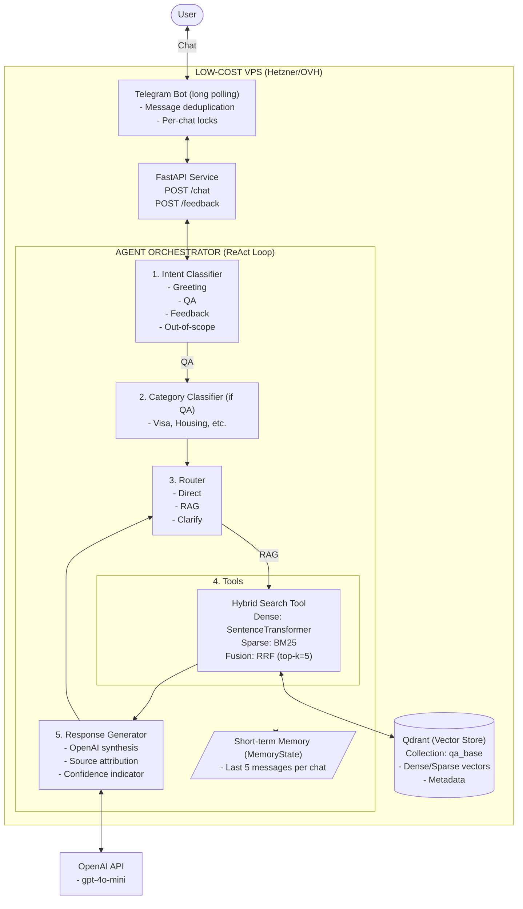
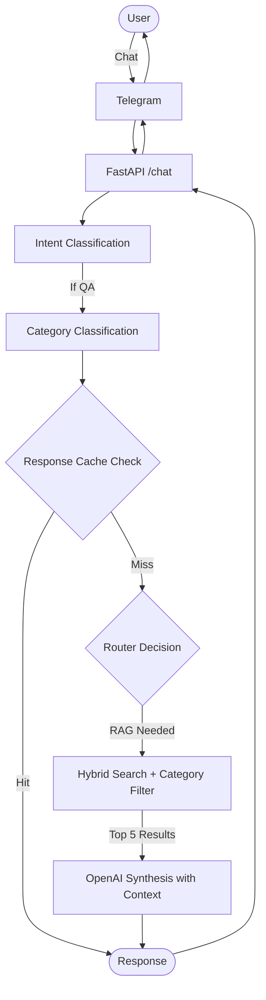
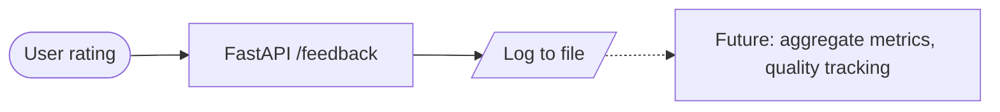

# Architecture - Brazilian Expats Chatbot MVP

## Overview

Knowledge-based chatbot serving Brazilian expats in Grenoble via Telegram. Handles ~100 users with 5-10 concurrent chats on a low-cost VPS (~$8-12/month).

## System Diagram



## Key Flows

### 1. Chat Flow


### 2. Retrieval Flow


### 3. Feedback Flow (MVP Simplified)


## Component Details

### 1. Telegram Bot Layer
- **Library**: `python-telegram-bot`
- **Mode**: Long polling (simpler than webhooks for MVP)
- **Concurrency**: Per-chat locks using `asyncio.Lock` dictionary
- **Idempotency**: Track processed `update_id` to prevent duplicates

### 2. FastAPI Service
- **Endpoints**:
  - `POST /chat`: Main conversation endpoint
  - `POST /feedback`: User ratings (thumbs up/down)
  - `GET /health`: Health check
- **Validation**: Pydantic models (size limits enforced)
- **Rate limiting**: Settings-driven in-memory counter (defaults to 100/hr)

### 3. Agent Orchestrator (LangGraph)
- **Graph structure**:
  ```
  START → Intent Classifier → Category Classifier → Router → [Search Tool] → Generator → END
  ```
- **State**: Custom `AgentState` with messages, context, intent, category
- **Memory**: `MemoryState` from langgraph (last 5 messages)

## Question Categories

When a message is classified as **QA intent**, it gets further categorized to improve retrieval and response quality.

### Category Taxonomy

| Category | Description | Examples |
|----------|-------------|----------|
| **visa** | Immigration, residence permits, work permits | "Como renovar titre de séjour?", "Preciso de visto para trabalhar?" |
| **housing** | Rent, accommodation, utilities | "Onde achar apartamento?", "Como funciona a caution?" |
| **healthcare** | Medical services, insurance, prescriptions | "Como marcar consulta?", "Onde fica o hospital?" |
| **banking** | Bank accounts, taxes, financial services | "Qual banco abrir conta?", "Como declarar imposto?" |
| **transport** | Public transit, bikes, car registration | "Como comprar passe de ônibus?", "Preciso carteira francesa?" |
| **education** | Schools, universities, childcare | "Como matricular filho na escola?", "Creches em Grenoble?" |
| **caf** | CAF benefits (APL, etc.) | "Como pedir APL?", "Documentos para CAF?" |
| **general** | Other daily life questions | "Onde comprar comida brasileira?", "Eventos brasileiros?" |

### Implementation

**Method**: Lightweight classification using OpenAI or local classifier

**OpenAI (MVP recommendation)**:
```python
prompt = f"""Classify this question into ONE category:
Categories: visa, housing, healthcare, banking, transport, education, caf, general

Question: {user_question}

Return only the category name."""
```

**Benefits**:
- ✅ More relevant results (housing questions → housing answers)
- ✅ Reduces cross-contamination (visa info in housing queries)
- ✅ Better analytics (track which topics are most asked)
- ✅ Enables category-specific prompts (future enhancement)

### Fallback Behavior

If category classifier is uncertain (confidence < 0.5):
- Use `category="general"`
- Search without category filter (broader search)
