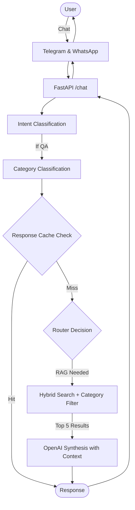
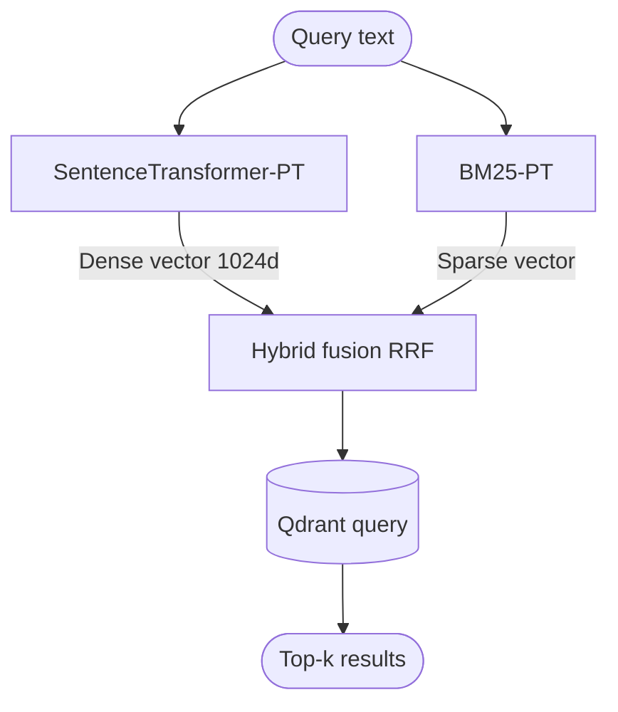
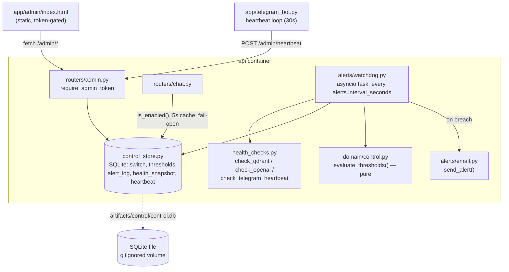

# Architecture - Brazilian Expats Chatbot MVP

## Overview

Knowledge-based chatbot serving Brazilian expats in Grenoble via Telegram and WhatsApp. Handles ~100 users with 5-10 concurrent chats on a low-cost VPS (~$8-12/month).

## System Diagram


## Key Flows

### 1. Chat Flow


### 2. Retrieval Flow


### 3. Feedback Flow (MVP Simplified)


## Component Details

### 1. Bot Client Layer (Telegram & WhatsApp)
- **Library**: `python-telegram-bot`
- **Mode**: Long polling (simpler than webhooks for MVP)
- **Concurrency**: Per-chat locks using `asyncio.Lock` dictionary
- **Idempotency**: Track processed `update_id` to prevent duplicates

### 2. FastAPI Service
- **Endpoints**:
  - `POST /chat`: Main conversation endpoint
  - `POST /feedback`: User ratings (thumbs up/down)
  - `GET /health`: Health check
- **Validation**: Pydantic models (size limits enforced)
- **Rate limiting**: Settings-driven in-memory counter (defaults to 100/hr)

### 3. Agent Orchestrator (LangGraph)
- **Graph structure**:
  ```
  START → Intent Classifier → Category Classifier → Router → [Search Tool] → Generator → END
  ```
- **State**: Custom `AgentState` with messages, context, intent, category
- **Memory**: `MemoryState` from langgraph (last 5 messages)

## Question Categories

When a message is classified as **QA intent**, it gets further categorized to improve retrieval and response quality.

### Category Taxonomy

| Category | Description | Examples |
|----------|-------------|----------|
| **visa** | Immigration, residence permits, work permits | "Como renovar titre de séjour?", "Preciso de visto para trabalhar?" |
| **housing** | Rent, accommodation, utilities | "Onde achar apartamento?", "Como funciona a caution?" |
| **healthcare** | Medical services, insurance, prescriptions | "Como marcar consulta?", "Onde fica o hospital?" |
| **banking** | Bank accounts, taxes, financial services | "Qual banco abrir conta?", "Como declarar imposto?" |
| **transport** | Public transit, bikes, car registration | "Como comprar passe de ônibus?", "Preciso carteira francesa?" |
| **education** | Schools, universities, childcare | "Como matricular filho na escola?", "Creches em Grenoble?" |
| **caf** | CAF benefits (APL, etc.) | "Como pedir APL?", "Documentos para CAF?" |
| **general** | Other daily life questions | "Onde comprar comida brasileira?", "Eventos brasileiros?" |

### Implementation

**Method**: Lightweight classification using OpenAI or local classifier

**OpenAI (MVP recommendation)**:
```python
prompt = f"""Classify this question into ONE category:
Categories: visa, housing, healthcare, banking, transport, education, caf, general

Question: {user_question}

Return only the category name."""
```

**Benefits**:
- ✅ More relevant results (housing questions → housing answers)
- ✅ Reduces cross-contamination (visa info in housing queries)
- ✅ Better analytics (track which topics are most asked)
- ✅ Enables category-specific prompts (future enhancement)

### Fallback Behavior

If category classifier is uncertain (confidence < 0.5):
- Use `category="general"`
- Search without category filter (broader search)

## Control Center — Ops Dashboard, Kill Switch & Cost Alerting

Full design: [`.specs/control-center/design.md`](../.specs/control-center/design.md) ·
[`.specs/control-center/spec.md`](../.specs/control-center/spec.md).

Adds a single operational safety net on top of the chatbot above — one dashboard for
health/usage/cost, one kill switch, and automation that disables the bot and emails the
operator the moment a threshold is breached. No new container: everything runs inside the
existing `api` service.



### Cost Center: How It Works

Because the bot serves a community with no per-user paywall, the **Cost Center** acts as a crucial safety net against budget overruns. It estimates cost in real-time without relying on delayed billing APIs.

1. **Token Counting**: During each LLM call (`agent.py`), the usage metadata (`tokens_in` and `tokens_out`) is extracted directly from the OpenAI response and attached to the `AgentState`.
2. **Cost Estimation**: The API converts these tokens into an estimated USD cost using pricing configurations (e.g., `$/1M tokens` rates defined in `base.yaml`) and records it in the append-only `logs/interactions.jsonl`.
3. **Aggregation & Monitoring**: Every `alerts.interval_seconds`, the background `watchdog.py` loop reads the logs and aggregates the total estimated cost for the day and the month.
4. **Breach Execution**: This aggregated cost is fed into the pure logic of `domain/control.py`. If `cost_today_usd` exceeds the configured `daily_cost_limit_usd` threshold, the watchdog immediately flips the master kill switch to `disabled` and fires an alert email to the operator, stopping all further API expenditure until manually re-enabled.

### Components

- **`domain/control.py`** — pure decision logic: `evaluate_thresholds(cost_today_usd,
  service_streaks, thresholds) -> BreachResult | None`. No I/O, so it's unit-testable with
  plain dicts. Cost is checked before health (more common/urgent breach for a community bot).
- **`infrastructure/control_store.py`** — SQLite persistence (`artifacts/control/control.db`)
  for the kill switch, editable thresholds, the append-only alert log, per-service health
  snapshots, and the Telegram bot's heartbeat. Also owns `is_enabled()`, an in-process 5s-TTL
  cache read by the chat path so the switch check costs no meaningful latency.
- **`infrastructure/health_checks.py`** — live probes for Qdrant (`get_collections()`), OpenAI
  (a metadata-only `models.retrieve`, never a completion — zero token cost), and the Telegram
  bot (reads its heartbeat, `critical` if stale beyond `3 × alerts.interval_seconds`).
- **`infrastructure/alerts/watchdog.py`** — an `asyncio.create_task` background loop (started
  in `main.py`, same pattern as the existing rate-limit cleanup task) that every
  `alerts.interval_seconds`: probes and snapshots health, aggregates today's cost from
  `logs/interactions.jsonl`, and — only while the switch is still on — asks
  `domain/control.py` whether a threshold is breached. On breach it disables the switch first,
  then best-effort emails via `alerts/email.py`; a broken mail relay never blocks the safety
  action. Edge-triggered: once disabled it keeps snapshotting for the dashboard but never
  re-alerts while already off.
- **`infrastructure/api/routers/admin.py`** — `require_admin_token` gates every route with
  `hmac.compare_digest` against `ADMIN_TOKEN` (env-only, never logged). Exposes `GET
  /admin/status`, `POST /admin/switch`, `POST /admin/thresholds`, `POST /admin/heartbeat`
  (called by the Telegram bot), `POST /admin/test-alert`.
- **`app/admin/index.html`** — static dashboard, calls `/admin/*` only, never imports agent
  logic (UI→API rule).
- **`app/telegram_bot.py`** — alongside its existing `_cleanup_processed_messages` task, an
  `asyncio.create_task` posts `POST /admin/heartbeat` every ~30s using the same `ADMIN_TOKEN`
  (no second credential to manage).

### Fail-open

The chat path (`control_store.is_enabled()`) never lets a broken control store take the bot
down: a read failure is caught and treated as "enabled," logged, and never raised. Since the
store can't record its own failure in a table it can't write to, `GET /admin/status`
(`routers/admin.py`) catches that same failure at request time and reports a synthetic
`control_store: critical` service row instead — the one place the operator can see it. See
`tests/unit/test_fail_open.py`.

### Config

`AdminConfig` (`ADMIN_TOKEN`), `PricingConfig` ($/1M token rates), and `AlertsConfig`
(interval, daily/monthly limits, health grace checks, SMTP) live in `config.py` /
`config/base.yaml`, read the same way `TelegramConfig`/`LLMConfig` already pull secrets from
`.env` — see `.env.example` for `ADMIN_TOKEN` and `SMTP_PASSWORD`. The SQLite file itself
(`artifacts/control/control.db`) is gitignored, same as the rest of `artifacts/`.
