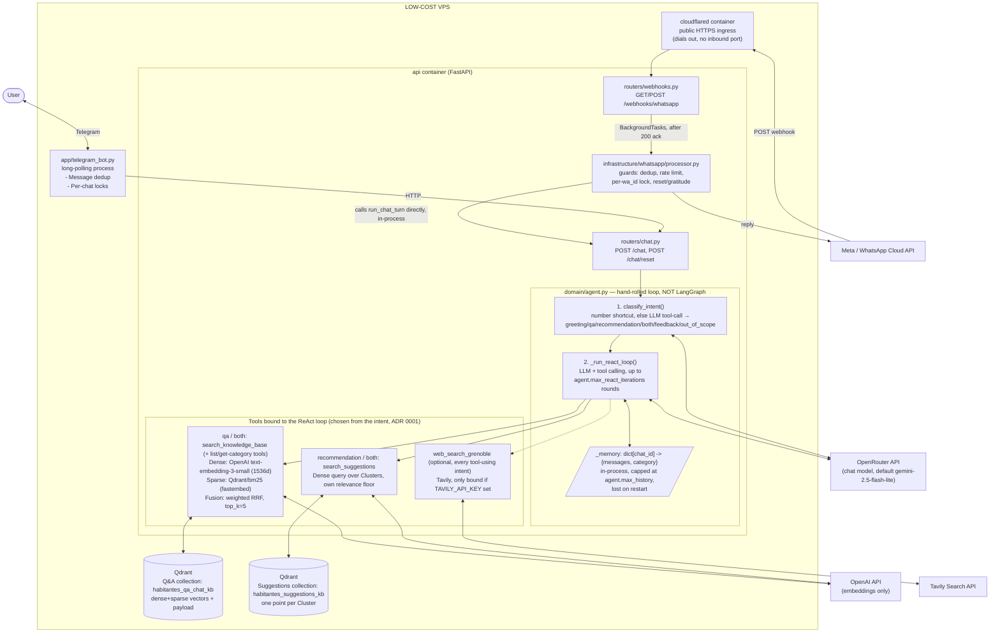
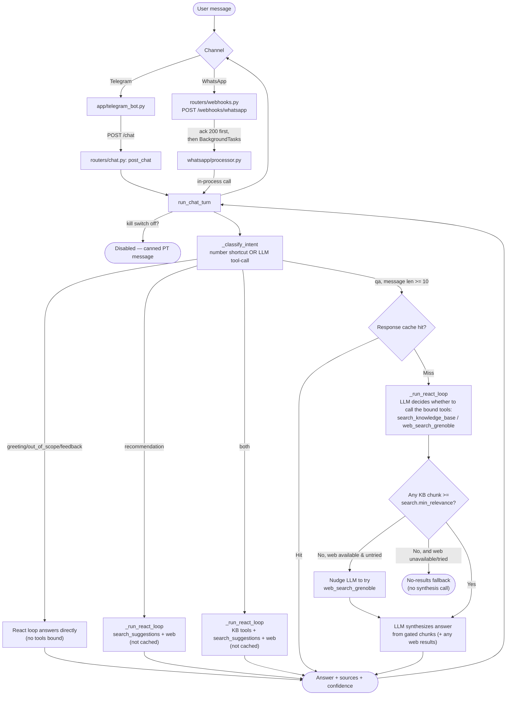
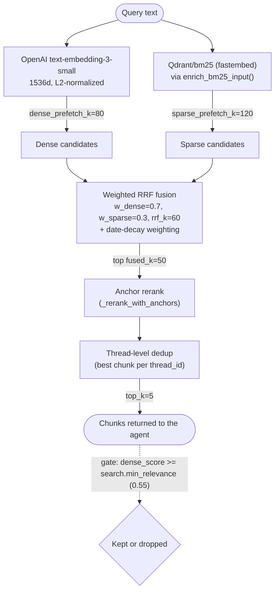
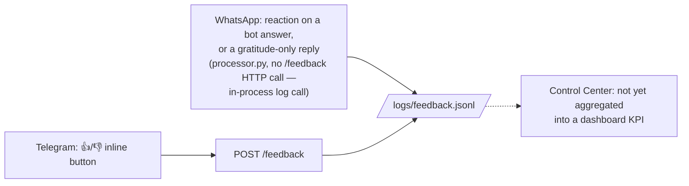
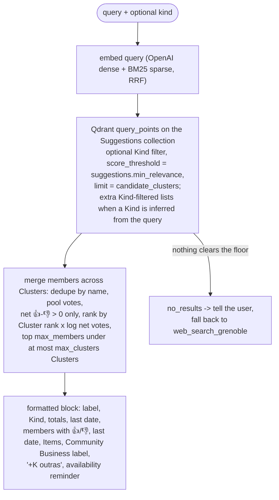
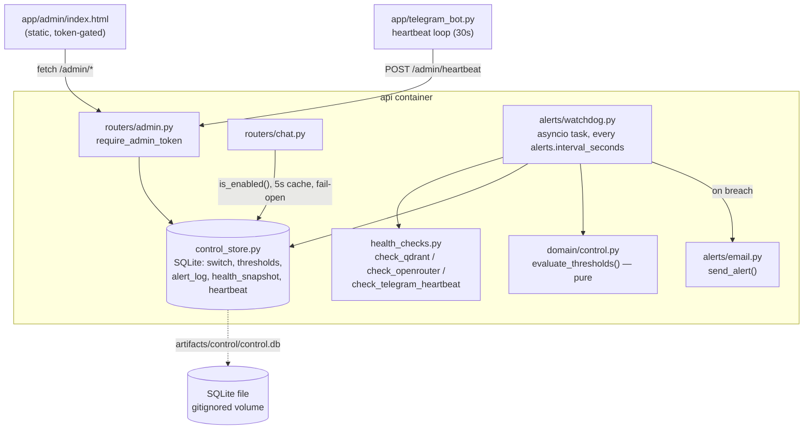

# Architecture - Brazilian Expats Chatbot MVP

## Overview

Knowledge-based chatbot serving Brazilian expats in Grenoble via Telegram and the official WhatsApp Cloud API. It answers procedural questions from a Q&A knowledge base and "who/where do you recommend?" requests from a separate Suggestions collection, both built offline from the same WhatsApp group export (see [Suggestions](#suggestions-community-recommendations)). Handles ~100 users with 5-10 concurrent chats on a low-cost VPS (~$8-12/month).

## System Diagram


```mermaid
flowchart TD
    User([User])

    subgraph VPS["LOW-COST VPS"]
        TGBot["app/telegram_bot.py<br>long-polling process<br>- Message dedup<br>- Per-chat locks"]
        CF["cloudflared container<br>public HTTPS ingress<br>(dials out, no inbound port)"]

        subgraph API["api container (FastAPI)"]
            Webhook["routers/webhooks.py<br>GET/POST /webhooks/whatsapp"]
            Processor["infrastructure/whatsapp/processor.py<br>guards: dedup, rate limit,<br>per-wa_id lock, reset/gratitude"]
            ChatRouter["routers/chat.py<br>POST /chat, POST /chat/reset"]

            subgraph Agent["domain/agent.py — hand-rolled loop, NOT LangGraph"]
                Intent["1. classify_intent()<br>number shortcut, else LLM tool-call →<br>greeting/qa/recommendation/both/feedback/out_of_scope"]
                React["2. _run_react_loop()<br>LLM + tool calling, up to<br>agent.max_react_iterations rounds"]
                Memory[/"_memory: dict[chat_id] -> {messages, category}<br>in-process, capped at agent.max_history,<br>lost on restart"/]
            end

            subgraph Tools["Tools bound to the ReAct loop (chosen from the intent, ADR 0001)"]
                Search["qa / both: search_knowledge_base (+ list/get-category tools)<br>Dense: OpenAI text-embedding-3-small (1536d)<br>Sparse: Qdrant/bm25 (fastembed)<br>Fusion: weighted RRF, top_k=5"]
                SuggTool["recommendation / both: search_suggestions<br>Dense query over Clusters, own relevance floor"]
                WebSearch["web_search_grenoble (optional, every tool-using intent)<br>Tavily, only bound if TAVILY_API_KEY set"]
            end
        end

        DB[("Qdrant<br>Q&A collection: habitantes_qa_chat_kb<br>dense+sparse vectors + payload")]
        SDB[("Qdrant<br>Suggestions collection: habitantes_suggestions_kb<br>one point per Cluster")]
    end

    OR["OpenRouter API<br>(chat model, default gemini-2.5-flash-lite)"]
    OAI["OpenAI API<br>(embeddings only)"]
    Tavily["Tavily Search API"]
    Meta["Meta / WhatsApp Cloud API"]

    User <-->|Telegram| TGBot
    TGBot -->|HTTP| ChatRouter
    Meta -->|POST webhook| CF --> Webhook
    Webhook -->|BackgroundTasks, after 200 ack| Processor
    Processor -->|calls run_chat_turn directly, in-process| ChatRouter
    Processor -->|reply| Meta

    ChatRouter --> Intent
    Intent --> React
    React <--> Memory
    React --> Search
    React --> SuggTool
    React -.-> WebSearch
    Search <--> DB
    SuggTool <--> SDB
    SuggTool <--> OAI
    Intent <--> OR
    React <--> OR
    Search <--> OAI
    WebSearch <--> Tavily
```

## Key Flows

### 1. Chat flow (shared by both channels)

Both Telegram and WhatsApp funnel into the same `run_chat_turn()` (`routers/chat.py`), which gates on the kill switch and then calls `domain/agent.run()`.


```mermaid
flowchart TD
    UserMsg([User message]) --> Channel{Channel}
    Channel -->|Telegram| TGBot[app/telegram_bot.py] -->|"POST /chat"| ChatEP[routers/chat.py: post_chat]
    Channel -->|WhatsApp| Webhook["routers/webhooks.py<br>POST /webhooks/whatsapp"] -->|"ack 200 first,<br>then BackgroundTasks"| Processor[whatsapp/processor.py] -->|in-process call| RunTurn[run_chat_turn]
    ChatEP --> RunTurn

    RunTurn -->|"kill switch off?"| Disabled([Disabled — canned PT message])
    RunTurn --> Classify["_classify_intent<br>number shortcut OR LLM tool-call"]
    Classify -->|greeting/out_of_scope/feedback| Direct["React loop answers directly<br>(no tools bound)"]
    Classify -->|recommendation| ReactRec["_run_react_loop<br>search_suggestions + web<br>(not cached)"] --> Answer
    Classify -->|both| ReactBoth["_run_react_loop<br>KB tools + search_suggestions + web<br>(not cached)"] --> Answer
    Classify -->|qa, message len >= 10| Cache{Response cache hit?}
    Cache -->|Hit| Answer
    Cache -->|Miss| React["_run_react_loop<br>LLM decides whether to call the bound tools:<br>search_knowledge_base / web_search_grenoble"]
    React --> Gate{"Any KB chunk >=<br>search.min_relevance?"}
    Gate -->|No, web available & untried| NudgeWeb["Nudge LLM to try<br>web_search_grenoble"]
    Gate -->|No, and web unavailable/tried| Fallback(["No-results fallback<br>(no synthesis call)"])
    Gate -->|Yes| Synth["LLM synthesizes answer<br>from gated chunks (+ any web results)"]
    NudgeWeb --> Synth
    Synth --> Answer([Answer + sources + confidence])
    Direct --> Answer
    Answer --> RunTurn
    RunTurn --> Channel
```

Category is **not** a separate classifier step. `state["category"]` is set only by the numbered-menu shortcut (`resolve_number`); for free-text questions (most traffic) it stays `""` through the whole turn and is derived *after the fact*, for analytics only, from the categories of the source chunks the search tool actually returned (`_derive_category_from_sources` in `agent.py`).

### 2. Retrieval flow — Q&A knowledge base (`domain/tools/search.py::hybrid_search`)

`search_suggestions` does not use this path; see [Suggestions](#suggestions-community-recommendations).


```mermaid
flowchart TD
    Query([Query text])
    Query --> Dense["OpenAI text-embedding-3-small<br>1536d, L2-normalized"]
    Query --> Sparse["Qdrant/bm25 (fastembed)<br>via enrich_bm25_input()"]

    Dense -->|"dense_prefetch_k=80"| DensePts[Dense candidates]
    Sparse -->|"sparse_prefetch_k=120"| SparsePts[Sparse candidates]

    DensePts --> Fusion["Weighted RRF fusion<br>w_dense=0.7, w_sparse=0.3, rrf_k=60<br>+ date-decay weighting"]
    SparsePts --> Fusion
    Fusion -->|"top fused_k=50"| Anchor["Anchor rerank<br>(_rerank_with_anchors)"]
    Anchor --> Dedup["Thread-level dedup<br>(best chunk per thread_id)"]
    Dedup -->|"top_k=5"| Chunks([Chunks returned to the agent])

    Chunks -.->|"gate: dense_score >= search.min_relevance (0.55)"| Gated{Kept or dropped}
```

The relevance gate operates on the **raw dense cosine score** (`dense_score`, preserved separately from the fused RRF score), not the fused score — RRF encodes rank, not absolute relevance.

### 3. Feedback flow

Two independent paths write to the same feedback log (`get_feedback_logger()` → `logs/feedback.jsonl`):


```mermaid
flowchart LR
    TGFeedback["Telegram: 👍/👎 inline button"] --> FeedbackEP["POST /feedback"]
    WAFeedback["WhatsApp: reaction on a bot answer,<br>or a gratitude-only reply<br>(processor.py, no /feedback HTTP call —<br>in-process log call)"] --> FeedbackLog
    FeedbackEP --> FeedbackLog[/logs/feedback.jsonl/]
    FeedbackLog -.-> ControlCenter[Control Center: not yet aggregated<br>into a dashboard KPI]
```

## Component Details

### 1. Channel layer

**Telegram** (`app/telegram_bot.py`): `python-telegram-bot`, long-polling, its own process/container. Per-chat `asyncio.Lock`s, tracks processed `update_id`s to dedup, posts a heartbeat to `POST /admin/heartbeat` every ~30s.

**WhatsApp** (official Cloud API — `infrastructure/whatsapp/`): **not** a separate process. Meta POSTs to `GET/POST /webhooks/whatsapp` (`routers/webhooks.py`), which lives inside the same FastAPI process as everything else:
- `client.py` — thin, fail-soft `httpx` wrapper over the Graph API `/messages` endpoint (`send_text`, `mark_read_and_typing`); every call swallows its own exception and returns a sentinel rather than raising.
- `processor.py` — the translation layer: dedup → guards (rate limit, length cap, reset command, gratitude-as-👍 short-circuit) → `run_chat_turn()` (the *same* function the Telegram/HTTP path calls) → reply. Runs via `BackgroundTasks` scheduled *after* the webhook already returned 200 — Meta expects a fast ack and retries on anything slower, and an agent turn (LLM + vector search) can easily exceed that.
- `guards.py` — pure helpers plus small in-process state: `hash_wa_id` (deterministic `sha256(salt + wa_id)` → `chat_id`), a sliding-window `RateLimiter`, a `DedupSet` keyed by Meta's message id, and a per-`wa_id` `KeyedLock` so two rapid messages from the same user can't race on the shared `_memory` dict in `agent.py`.
- **`cloudflared`** (its own container in `docker-compose.yml`, no code in this repo) — dials out to Cloudflare's edge and exposes `/webhooks/whatsapp` over public HTTPS, since Meta cannot POST to a homelab's `localhost`. No inbound firewall port needs opening for it.
- Inbound signature verification: every POST's `X-Hub-Signature-256` header is HMAC-checked against `WHATSAPP_APP_SECRET` over the *raw* request body before it's even parsed as JSON (`webhooks.py::_verify_signature`) — fails closed if the secret is unset.
- See [docs/WHATSAPP_CLOUD_SETUP.md](WHATSAPP_CLOUD_SETUP.md) for the manual Meta Business/App dashboard steps (Phone Number ID, WABA ID, permanent token, and the easy-to-miss webhook *subscription* step).

### 2. FastAPI Service

- **Endpoints** (`infrastructure/api/routers/`, all mounted by `main.py`):
  - `POST /chat/` — main conversation endpoint
  - `POST /chat/reset` — clear a chat's short-term memory (not kill-switch gated)
  - `POST /feedback/` — user ratings (thumbs up/down)
  - `GET /health/` — health check (pings Qdrant)
  - `GET /webhooks/whatsapp` — Meta's webhook verification handshake
  - `POST /webhooks/whatsapp` — inbound WhatsApp events (messages, reactions)
  - `GET /admin/status`, `POST /admin/switch`, `POST /admin/thresholds`, `POST /admin/heartbeat`, `POST /admin/test-alert` — Control Center, all behind `X-Admin-Token` (see below)
  - `GET /` — root liveness ping
  - Static mount `/admin/ui` → `app/admin/` (the dashboard frontend), only mounted if that directory exists in the image
- **Validation**: Pydantic models (size limits enforced)
- **Rate limiting**: in-memory sliding counter on `/chat` and `/feedback`, keyed by `X-Chat-Id` header or client IP, defaults to `api.rate_limit_per_hour` (100/hr); reset on process restart

### 3. Agent Orchestrator (`domain/agent.py`) — hand-rolled, not a graph framework

There is **no LangGraph dependency** in this codebase. The orchestration is a plain Python function pipeline:

```
run(chat_id, message, ...)
  → _classify_intent(state)          # Layer 1
  → cache check (qa intent only; keyed per chat)
  → _run_react_loop(state)           # Layer 2, skipped on cache hit
  → _update_memory(...)              # persists into the in-process dict
```

- **Layer 1 — `_classify_intent`**: a bare digit 1–19 short-circuits straight to `intent="qa"` with the matching category, no LLM call. Otherwise a single LLM call, forced via OpenAI-style tool-calling (`bind_tools([IntentClassification], tool_choice="IntentClassification")`) to return structured `{"intent": ...}` — chosen specifically to avoid parsing free-form JSON out of model text. The intent is one of `greeting | qa | recommendation | both | feedback | out_of_scope`: `qa` is a procedural/informational question, `recommendation` asks who or where to go to (a business, place, professional or product), `both` is one message with both parts (e.g. "como traduzir meus documentos e qual tradutor vocês indicam?"). On any parse failure, defaults to `out_of_scope`.
- **Layer 2 — `_run_react_loop`**: builds a system prompt (`REACT_SYSTEM_PROMPT` + intent-specific instructions; `recommendation`/`both` add `RECOMMENDATION_INSTRUCTIONS`, `both` also `BOTH_INSTRUCTIONS`), then loops up to `agent.max_react_iterations` times calling the LLM with tools bound. **The tool set is derived from the intent, not chosen by the model** ([ADR 0001](adr/0001-tools-chosen-from-classified-intent.md)):

  | intent | tools bound |
  |---|---|
  | `qa` | `search_knowledge_base`, `list_knowledge_subcategories`, `get_chunks_by_category` + web search |
  | `recommendation` | `search_suggestions` + web search |
  | `both` | the knowledge-base tools + `search_suggestions` + web search |
  | `greeting`, `feedback`, `out_of_scope` | none |

  `web_search_grenoble` is added only if `web_search.enabled` and `TAVILY_API_KEY` is set. Knowledge-base tools are only bound for a message of at least 10 characters (shorter gets a clarification request); a short recommendation ("dentista") is still a valid request. The model decides whether and how often to call a bound tool, but cannot reach one outside its intent's set, so a procedural question never sees `search_suggestions`. Adding a tool means extending `_KB_INTENTS` / `_SUGGESTION_INTENTS` in `agent.py`, not prompting. Stops when the LLM returns no further tool calls.
- **State**: a plain `dict` (`AgentState` TypedDict-like structure in `domain/state.py`), not a LangGraph `StateGraph`.
- **Memory**: `_memory: dict[str, dict]` in `agent.py`, keyed by `chat_id`, storing `{"messages": [...], "category": ...}`, capped at `agent.max_history` turns (default 5). Purely in-process — no Redis, no DB, no LangGraph checkpointer. Lost on every API restart/redeploy.
- **Confidence**: `1.0` for greeting/out_of_scope/feedback; `0.5` for a too-short `qa`/`both` message (clarification, no search performed); the top dense cosine score (`min(1.0, top_dense)`) for a normal KB answer, or the best Cluster score for a Suggestions answer; `web_search.answer_confidence` (fixed, default `0.5`) for a web-only answer with no KB chunks; `0.0` on a search error.

## Suggestions (community recommendations)

A second knowledge base next to the Q&A one. Q&A Pairs only capture messages parsed as questions that received answers, so most unprompted opinions never reach it; the Suggestions pipeline finds those opinions anywhere in the chat. Terms (Suggestion, Kind, Mention, Context, Item, Cluster, Community Business, Recommendation Request) are defined in [CONTEXT.md](../CONTEXT.md); the setup, configuration table and run commands are in the [README](../README.md#suggestions-community-recommendations).

### Ingestion pipeline (offline, `ingestion/suggestions/`)


```mermaid
flowchart LR
    Chat[WhatsApp export] --> Parse["shared parse + Thread split<br>(unchanged)"]
    Parse --> Win["windows.py<br>keyword lexicon -> windows<br>(merged, never cross a Thread)"]
    Win --> Jev["Jev yes/no per window<br>(jev_cutoff)"]
    Jev --> Ext["extract.py<br>pseudonymise (M1, M2...) + scrub phones<br>LLM -> Mentions"]
    Ext --> MF[("mentions.jsonl<br>author-free")]
    MF --> Merge["exclusions.py + merge.py<br>opt-out list, normalise names,<br>per-Kind variant merge"]
    Merge --> SF[("suggestions.jsonl<br>author-free")]
    SF --> Clu["clusters.py<br>per-Kind similarity clustering,<br>rank, LLM label + summary"]
    Clu --> Load["load/suggestions.py<br>rebuild collection"]
    Load --> SDB[("Qdrant: habitantes_suggestions_kb")]
```

- **Windows** — a lexicon over every message regardless of its question/answer label (request phrases open a longer forward window, `window_after_request`; everything else `window_after_other`; `window_before` before). Overlapping windows merge; a window never crosses a Thread boundary. Keywords only select windows: no single keyword is precise.
- **Jev filter** — `classify_window` in `preprocess/jev.py`, the same OpenRouter decisions endpoint and retry convention as the Q&A gate, asks one yes/no question ("does this contain a Suggestion?"). It does not assign the Kind. A window it cannot classify is not extracted.
- **Extraction** — authors become M1, M2... before any text leaves the module and phone numbers are scrubbed; a JSON-schema LLM call returns Mentions (name, Kind, polarity, Items, Context, date, Community Business flag). The model also tags entity type; private individuals, banks, phone operators, apps, associations, public services and one-off events are dropped. A Community Business is flagged only when the text shows a business identity beyond the member's own name or number. The `Mention` model has no author field and forbids extra fields.
- **Merge** — names normalised in code (`normalise_name`), a fixed exclusion list for banks/operators/apps/public services plus the maintained opt-out list (`config/suggestion_exclusions.txt`), then one LLM pass per Kind merges variants (a chain is one Suggestion whichever branch is named). Counting happens only after this. `Suggestion` = same normalised name + same Kind, with 👍/👎 counts, last date, all Items and Contexts.
- **Clusters** — within a Kind, Mentions (not Suggestions) are grouped by cosine similarity of Items + Context with a greedy leader algorithm and `similarity_cutoff` (fewer than 4 Mentions form one Cluster); there is no fixed group count, and a Suggestion can sit in two Clusters. A Cluster collapses repeated Mentions into one member line per name. A Community Business advertiser's own post is stored but not counted, so it needs a Mention from another member to appear.
- **Ranking and summary** — score = +1 per 👍, -1 per 👎, Mentions older than `ranking_half_life_years` count half; ties go to the most recent; members scoring 0 or less are left out of the summary; the top `summary_size` are named with "+K outras". An LLM writes the Cluster label and one reworded line per member. All members stay in the stored payload.
- **Load** — only the Suggestions collection is deleted and recreated (the Q&A collection is never touched). One point per Cluster; point id = md5(`kind|label`). Dense vector from the summary plus every member's Items; sparse (`Qdrant/bm25`) vector from the Items plus every member name; payload = Topic, Kind, label, totals, last date, members (name, counts, last date, Items, Community Business flag), summary. Topic is derived from Kind via a fixed mapping in `api/src/habitantes/domain/suggestions.py` (`KIND_TOPIC`), never extracted, so it can be filtered by the same Topics as Q&A. It is a known simplification (a lawyer is under Daily Life & Services, not Visa & Residency).
- **Kinds** — Restaurants & Bars, Markets & Groceries, Shops, Products, Salons & Beauty, Gyms & Sports, Doctors, Dentists, Translators, Professional Services, Courses & Teachers, Vets & Pets, Places & Outings, Other. No contacts, opening hours, prices or closure status are stored.
- **CLI** — `make mentions` (stage `mentions`: parse, classify, windows, Jev, extraction -> `mentions.jsonl`) and `make suggestions` (stage `suggestions`: merge, opt-out, Clusters, load, from `mentions.jsonl`). `suggestions.jsonl` is written as the author-free on-disk source of the merge result; `build.py` can rebuild from it (`from_suggestions_file`) but that mode has no CLI flag. Both files are in the retention cleanup list in `ingestion/pipeline.py`.

### Query side: `search_suggestions` (`domain/tools/suggestions.py`)


```mermaid
flowchart TD
    Q([query + optional kind]) --> Emb["embed query (OpenAI dense + BM25 sparse, RRF)"]
    Emb --> Qd["Qdrant query_points on the Suggestions collection<br>optional Kind filter, score_threshold = suggestions.min_relevance,<br>limit = candidate_clusters;<br>extra Kind-filtered lists when a Kind is inferred from the query"]
    Qd --> Pick["merge members across Clusters: dedupe by name, pool votes,<br>net 👍-👎 > 0 only, rank by Cluster rank x log net votes,<br>top max_members under at most max_clusters Clusters"]
    Pick --> Out["formatted block: label, Kind, totals, last date,<br>members with 👍/👎, last date, Items, Community Business label,<br>'+K outras', availability reminder"]
    Qd -->|nothing clears the floor| None["no_results -> tell the user,<br>fall back to web_search_grenoble"]
```

- Shows at most `max_members` (20) members under at most `max_clusters` (6) Clusters; if more qualified, a note says more suggestions exist. Output size is bounded (names and Items are clipped, at most 3 Items per member). The final answer lists at most 7 picks (`_MAX_RENDERED_PICKS`, same number as the prompt), rendered in code from the tool data for the members the model named; see [ADR 0002](adr/0002-recommendation-retrieval-and-rendering.md).
- Own relevance floor (`suggestions.min_relevance`, 0.55 dense cosine), independent of the Q&A gate (`search.min_relevance`); the Q&A gate operates only on `search_knowledge_base` results. The dense branch keeps the floor; the sparse (keyword) branch has none, so a place named for a specific item is still found. All lists are fused with RRF; when no `kind` is passed, Kinds are inferred from Portuguese category keywords (`KIND_KEYWORDS_PT`) and add Kind-filtered lists to the fusion. The same keywords are embedded with each Cluster at ingestion.
- A member with more 👎 than 👍 (net <= 0) is never returned, so it is never offered. Looking a place up by name only works if it is a member of some Cluster; a place not retrievable falls through to web search.
- Errors (embedding, Qdrant) come back as the same structured error shape as the KB tool.

### Answering a Recommendation Request

`RECOMMENDATION_INSTRUCTIONS` (`prompts/synthesis.py`): lead with the community's picks; one item per Suggestion with name, 👍/👎, latest Mention date (dd/mm/aaaa) and one reworded context line; negative opinions only as 👎 counts; Community Businesses labelled "negócio de membro do grupo — divulgação própria"; say these are community recommendations (a summary of the top picks, not exhaustive) and remind the user to confirm availability; never quote messages or name authors; only use names returned by the tools. If `search_suggestions` finds nothing, the agent says the community recommended nothing and a web search follows (the loop forces one web pass if the model does not make it), with the web results clearly separated. For `both`, `BOTH_INSTRUCTIONS` asks for one reply with the procedural part and the recommendations clearly separated. Recommendation and `both` turns are not cached.

### Privacy properties

Author names and numbers never reach the extraction LLM (pseudonyms, phone scrubbing), `mentions.jsonl`, `suggestions.jsonl` or the collection (the models forbid author fields). Because those files have no author, a member's entries cannot be picked out: `ingestion/erase.py` deletes them and, unless `--skip-rebuild`, rebuilds from the redacted export. See [PRIVACIDADE.md](PRIVACIDADE.md).

## Question Categories

Categories are **not** produced by a separate classifier node. They come from one of two places: the numbered-menu shortcut (`resolve_number` in `domain/categories.py`, e.g. the user types `3`), or — for free-text questions — inferred after the fact from whichever category label the retrieved chunks actually carry (`_derive_category_from_sources`), purely for analytics/logging. There is no LLM call dedicated to category assignment.

The 19 categories are defined in `config/base.yaml`'s `categories:` block (single source of truth — `pt_name` shown to users, `en_name` used as the Qdrant filter value):

| # | Portuguese (shown to user) | English (Qdrant filter) |
|---|---|---|
| 1 | Visto & Residência | Visa & Residency |
| 2 | Bancos & Finanças | Banking & Finance |
| 3 | Moradia & CAF | Housing & CAF |
| 4 | Saúde & Seguros | Health & Insurance |
| 5 | Universidade & Estudos | University & Studies |
| 6 | Trabalho & Estágio | Work & Internship |
| 7 | Documentos & Burocracia | Documents & Bureaucracy |
| 8 | Vida Diária & Serviços | Daily Life & Services |
| 9 | Viagem & Transporte | Travel & Transport |
| 10 | Integração & Idioma | Integration & Language |
| 11 | Ski & Trilhas | Ski & Trekking |
| 12 | Alimentação & Restaurantes | Food & Restaurants |
| 13 | Esportes & Atividades | Sports & Activities |
| 14 | Vida Noturna & Eventos | Nightlife & Events |
| 15 | Bairros & Segurança | Neighbourhood & Safety |
| 16 | Compra & Venda | Marketplace & Buy/Sell |
| 17 | Cabelo & Beleza | Hair & Beauty |
| 18 | Pets & Animais | Pets & Animals |
| 19 | Telefone & Telecom | Phone & Telecom |

### Intent classification prompt

The actual system prompt (`domain/prompts/intent.py::_SYSTEM`, abridged — see the file for the full text):

```text
You are an intent classifier for a Telegram chatbot that helps Brazilian expats in Grenoble, France.

Classify the user's message into EXACTLY one of the following intents:

- greeting     : The user is greeting the bot (...)
- qa           : The user is asking a question about Grenoble or expat life there. (...)
- recommendation : The user asks WHO or WHERE to go to for something: a business, place,
                 professional or product (e.g., "indicação de dentista", "onde compro
                 massa de pastel?"). Only the request for names/places.
- both         : One message with BOTH a procedural question AND a who/where request.
- feedback     : The user is giving positive or negative feedback about a previous answer (...)
- out_of_scope : The user is sending a message NOT about Grenoble (...)
```

"Best of"/recommendation questions are no longer filed under `qa`; they are `recommendation`. Note the docstring/prompt text still says "Respond ONLY with valid JSON" — in practice the model's answer is never parsed as free text; `_classify_intent` forces tool-calling (`tool_choice="IntentClassification"`) and reads `response.tool_calls[0]["args"]` instead, which is what actually enforces valid structured output.

## Web search (Tavily) — role and limitations

`domain/tools/web_search.py` + `WebSearchConfig` (`config.py` / `config/base.yaml`'s `web_search:` block). A **lower-priority, optional secondary source** — the Qdrant collections (Q&A and Suggestions) are preferred; the ReAct loop's system prompt and tool docstring both frame it as a fallback for current/factual/generalist info, or to double-check a KB answer in a "perishable data" category (prices, schedules, official procedure rules).

Known limitations, verified against the current code and config:

1. **Fully optional, fails silently.** `web_available = bool(web_search.enabled and tavily_api_key)` (`agent.py`) — a missing `TAVILY_API_KEY` simply means the tool is never bound to the LLM. No error, no log line visible to the user; the bot just answers KB-only.
2. **No rate limiting, quota tracking, retry, or backoff.** `web_search()` makes exactly one `httpx.post` per call with no retry loop anywhere in the path (unlike the ingestion pipeline's synthesis step, which does retry).
3. **Tavily spend is invisible to the Control Center.** The cost dashboard and the daily-cost kill switch (`_compute_cost` in `agent.py`, `PricingConfig`) only account for LLM token usage (`tokens_in`/`tokens_out`). Tavily API calls cost nothing in that accounting regardless of actual Tavily billing.
4. **Worst-case added latency is bounded but not small.** `web_search.timeout_seconds` (8s) × `agent.max_react_iterations` (5) = a theoretical worst case of **40s** added if the ReAct loop invoked web search on every single iteration and it timed out every time. In practice a turn calls it at most once or twice, but there's no code-level cap on how many times the LLM could choose to call it within the iteration budget.
5. **Grenoble scoping is a string suffix, not a geo filter.** `_scope_query()` appends `web_search.location_suffix` ("Grenoble France") to the query text unless "grenoble" already appears in it (accent/case-insensitive) — there is no geographic API parameter involved, so off-topic or non-local results are possible if Tavily's own relevance ranking misses.
6. **Snippets only, never full pages.** Tavily is called with `max_results=3` and `search_depth="basic"` — the tool only ever sees titles/URLs/short `content` snippets from Tavily's own response; nothing is fetched or scraped beyond that.
7. **Published date is frequently empty.** `published_date` is read straight from Tavily's response with `r.get("published_date", "")` — Tavily commonly omits it, so recency often can't be verified even when the query was explicitly about "current" info.
8. **Fixed confidence, independent of result quality.** A web-only answer (no KB chunks used) always gets `web_search.answer_confidence` (default `0.5`) as its confidence score, regardless of how relevant or well-matched the actual Tavily results were — Tavily's own per-result `score` field is carried through the data but never used for this.
9. **Bypasses the KB relevance gate entirely.** `search.min_relevance` only filters `search_knowledge_base` results (and `search_suggestions` has its own `suggestions.min_relevance`) (`agent.py`'s gating block checks for a `"chunks"` key in the tool result); web results arrive as a `{"results": [...]}` dict and go straight into `sources`/`web_used` with no equivalent quality floor.
10. **Errors collapse into three coarse categories.** `_classify_web_error` maps any raised exception to `WEB_SEARCH_TIMEOUT` (an `httpx.TimeoutException`) or `WEB_SEARCH_UNREACHABLE` (anything else); combined with `WEB_SEARCH_DISABLED` (missing key) that's the full error taxonomy. All three are further collapsed into a single generic Portuguese string ("Busca web indisponível no momento.") before reaching the ReAct loop — a web failure never surfaces its specific cause and never hard-fails the turn.

## Control Center — Ops Dashboard, Kill Switch & Cost Alerting

> Design/spec documents for this feature live under `.specs/control-center/` in some working trees, but that directory is **gitignored** (see `.gitignore`'s "Local agent config / working notes and specs" section) — it is not part of the repository history and won't exist after a fresh clone. This section is the durable, versioned description of the feature.

Adds a single operational safety net on top of the chatbot above — one dashboard for
health/usage/cost, one kill switch, and automation that disables the bot and emails the
operator the moment a threshold is breached. No new container: everything runs inside the
existing `api` service.


```mermaid
flowchart TD
    Dash["app/admin/index.html<br>(static, token-gated)"] -->|fetch /admin/*| AdminRouter
    TGBot["app/telegram_bot.py<br>heartbeat loop (30s)"] -->|POST /admin/heartbeat| AdminRouter

    subgraph API["api container"]
        AdminRouter["routers/admin.py<br>require_admin_token"]
        ChatRouter["routers/chat.py"]
        Watchdog["alerts/watchdog.py<br>asyncio task, every alerts.interval_seconds"]
        Control["domain/control.py<br>evaluate_thresholds() — pure"]
        Store[("control_store.py<br>SQLite: switch, thresholds,<br>alert_log, health_snapshot, heartbeat")]
        Health["health_checks.py<br>check_qdrant / check_openrouter /<br>check_telegram_heartbeat"]
        Email["alerts/email.py<br>send_alert()"]
    end

    ChatRouter -->|"is_enabled(), 5s cache, fail-open"| Store
    AdminRouter --> Store
    Watchdog --> Health
    Watchdog --> Store
    Watchdog --> Control
    Watchdog -->|on breach| Email

    Store -.->|artifacts/control/control.db| DB[("SQLite file<br>gitignored volume")]
```

### Cost Center: How It Works

Because the bot serves a community with no per-user paywall, the **Cost Center** acts as a crucial safety net against budget overruns. It estimates cost in real-time without relying on delayed billing APIs. It tracks **LLM token cost only** — see the Tavily limitation above for what it does *not* cover.

1. **Token Counting**: During each LLM call (`agent.py`), the usage metadata (`tokens_in` and `tokens_out`) is extracted directly from the OpenRouter response and attached to the `AgentState`.
2. **Cost Estimation**: The API converts these tokens into an estimated USD cost using pricing configurations (e.g., `$/1M tokens` rates defined in `base.yaml`) and records it in the append-only `logs/interactions.jsonl`.
3. **Aggregation & Monitoring**: Every `alerts.interval_seconds`, the background `watchdog.py` loop reads the logs and aggregates the total estimated cost for the day and the month.
4. **Breach Execution**: This aggregated cost is fed into the pure logic of `domain/control.py`. If `cost_today_usd` exceeds the configured `daily_cost_limit_usd` threshold, the watchdog immediately flips the master kill switch to `disabled` and fires an alert email to the operator, stopping all further API expenditure until manually re-enabled.

### Components

- **`domain/control.py`** — pure decision logic: `evaluate_thresholds(cost_today_usd,
  service_streaks, thresholds) -> BreachResult | None`. No I/O, so it's unit-testable with
  plain dicts. Cost is checked before health (more common/urgent breach for a community bot).
- **`infrastructure/control_store.py`** — SQLite persistence (`artifacts/control/control.db`,
  pinned there via `CONTROL_DB_PATH` under Docker) for the kill switch, editable thresholds,
  the append-only alert log, per-service health snapshots, and the Telegram bot's heartbeat.
  Also owns `is_enabled()`, an in-process 5s-TTL cache read by the chat path so the switch
  check costs no meaningful latency.
- **`infrastructure/health_checks.py`** — live probes for Qdrant (`get_collections()`), OpenRouter
  (a metadata-only `models.retrieve`, never a completion — zero token cost), and the Telegram
  bot (reads its heartbeat, `critical` if stale beyond `3 × alerts.interval_seconds`). WhatsApp
  has no heartbeat entry — it's webhook-driven, not a poll loop, so "the API answers" is its
  liveness signal (see `alerts.heartbeat_services` in `config/base.yaml`, which only lists
  `telegram_bot`).
- **`infrastructure/alerts/watchdog.py`** — an `asyncio.create_task` background loop (started
  in `main.py`, same pattern as the existing rate-limit cleanup task) that every
  `alerts.interval_seconds`: probes and snapshots health, aggregates today's cost from
  `logs/interactions.jsonl`, and — only while the switch is still on — asks
  `domain/control.py` whether a threshold is breached. On breach it disables the switch first,
  then best-effort emails via `alerts/email.py`; a broken mail relay never blocks the safety
  action. Edge-triggered: once disabled it keeps snapshotting for the dashboard but never
  re-alerts while already off.
- **`infrastructure/api/routers/admin.py`** — `require_admin_token` gates every route with
  `hmac.compare_digest` against `ADMIN_TOKEN` (env-only, never logged). Exposes `GET
  /admin/status`, `POST /admin/switch`, `POST /admin/thresholds`, `POST /admin/heartbeat`
  (called by the Telegram bot), `POST /admin/test-alert`.
- **`app/admin/index.html`** — static dashboard, calls `/admin/*` only, never imports agent
  logic (UI→API rule).
- **`app/telegram_bot.py`** — alongside its existing message-dedup cleanup task, an
  `asyncio.create_task` posts `POST /admin/heartbeat` every ~30s using the same `ADMIN_TOKEN`
  (no second credential to manage).

### Fail-open

The chat path (`control_store.is_enabled()`) never lets a broken control store take the bot
down: a read failure is caught and treated as "enabled," logged, and never raised. Since the
store can't record its own failure in a table it can't write to, `GET /admin/status`
(`routers/admin.py`) catches that same failure at request time and reports a synthetic
`control_store: critical` service row instead — the one place the operator can see it. See
`tests/unit/test_fail_open.py`.

### Config

`AdminConfig` (`ADMIN_TOKEN`), `PricingConfig` ($/1M token rates), and `AlertsConfig`
(interval, daily/monthly limits, health grace checks, SMTP) live in `config.py` /
`config/base.yaml`, read the same way `TelegramConfig`/`LLMConfig` already pull secrets from
`.env` — see `.env.example` for `ADMIN_TOKEN` and `SMTP_PASSWORD`. The SQLite file itself
(`artifacts/control/control.db`) is gitignored, same as the rest of `artifacts/`.
