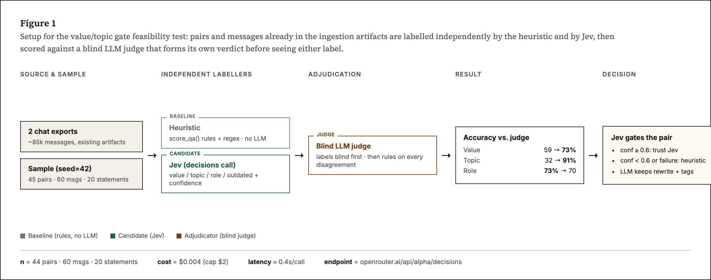

# JEV Benchmark — replacing the heuristic value/topic gate

A feasibility test (POC) comparing the current hand-tuned heuristic against
[TypeSafe's Jev](https://openrouter.ai/~typesafe/jev-latest) (`typesafe/jev-router`
family, called directly as `~typesafe/jev-latest`) for deciding which
WhatsApp Q&A threads are worth ingesting into the knowledge base. All
scripts, samples and raw results live outside the repo (Claude's scratchpad);
nothing in this test touched production code or data.

## Why

Today, "is this thread worth ingesting" is decided entirely by
[`score_qa`](../ingestion/preprocess/qa_pairs.py) — a point-scoring function
over surface features of the answer text (length, links, an "official
domain" regex, an "actionable language" regex, number of distinct
answerers, a confirmation flag, message year). It never reads the question
semantically. Topic is assigned the same way, by regex keyword matching
over the question and the five preceding messages. Both numbers then gate
what goes to the synthesis LLM and, later, what the loader accepts into
Qdrant.

The idea: replace this gate with Jev, a small, fast classifier model, and
keep the existing LLM only for the parts that need generation (rewriting
the question/answer, picking a subcategory, tags, key terms).

## Setup

**Call shape.** Jev is not a chat model — it's a dedicated endpoint,
`POST https://openrouter.ai/api/alpha/decisions`, called with
`{model, state, questions}`. Each question is one of `noul` (yes/no
probability), `choice` (probability per option + a `choice` + a
`confidence`), or `score`. Several questions can be asked of the same
`state` in one call, in parallel — e.g. the pair-level call asked for
`value`, `topic`, `outdated`, `needs_review` and three diagnostic
sub-questions in a single request.

**Cost/latency observed.** ~0.4s per call, ~$0.00002–0.00005 per
multi-question call. Labelling all 125 sampled items cost **$0.004**
against a $2 cap. Extrapolated, labelling the full ~80k-message corpus
would cost a few dollars, not the API budget concern it might have been.

**Judge.** A separate Claude sub-agent blind-labelled every sampled item
against a written rubric (below), without seeing either the heuristic or
Jev's label, then adjudicated every case where heuristic and Jev disagreed
(which method was right, or neither). Its accuracy numbers are against its
own blind judgement, not against either method — this is what makes the
result "who's actually correct," not just "how often do the two agree."

**Value rubric used (for both Jev and the judge):**
- **HIGH** — a common problem for newcomers, not a one-off, with a rich and
  complete answer that could be reused as-is.
- **MEDIUM** — still helps newcomers but the answer is partial, or the
  thread is poorly organized.
- **LOW** — personal, one-off, only relevant to that moment, or a bad
  answer.
- **UNKNOWN** — cannot be judged from the given text.

## Results

| Decision | Heuristic accuracy (vs blind judge) | Jev accuracy (vs blind judge) |
|---|---|---|
| Value (HIGH/MED/LOW/UNKNOWN), n=44 | 59% | **73%** |
| Topic (20 categories), n=44 | 32% | **91%** |
| Role (question/answer/…), n=60 | 73% | 70% |

On the subset where heuristic and Jev disagreed:

| Decision | Heuristic right | Jev right | Ambiguous / both wrong |
|---|---|---|---|
| Value (27 disagreements) | 37% | **59%** | 4% |
| Topic (15 spot-checked of 31 disagreements) | 0% | **~87%** | ~13% |
| Role (33 disagreements) | **52%** | 45% | 3% |

**Confidence is a usable signal.** Bucketing Jev's `value` accuracy by its
own reported confidence:

| Jev confidence | n | Value accuracy |
|---|---|---|
| ≥ 0.8 | 17 | 94% |
| 0.6–0.8 | 14 | 71% |
| < 0.6 | 12 | 50% (coin-flip) |

Recommended production threshold: **0.6**. Below it, fall back to the
heuristic tier rather than trusting Jev's call (this was already agreed as
the failure-handling behavior for outright API errors — the same fallback
now also covers low-confidence calls).

**Statements.** Of 20 messages the heuristic currently discards as
`statement`, the judge found 6 (30%) genuinely useful to many newcomers
(a lease lead, medication-to-bring-from-Brazil advice, an official
driving-licence link, a ski-resort price comparison, etc.). Jev's
`is_useful ≥ 0.5` matched the judge on 18/20 (90%) — one near-miss false
negative right at the threshold, one false positive on a message that was
emotionally charged but not actually informative. This isn't part of the
current change; it's a candidate for a later "useful statements" feature.

## Failure modes found

**Heuristic's failures** (why it underperforms): it rewards surface
features regardless of relevance. Concrete examples from the sample: a
florist question whose answer was an unrelated resale of a travel voucher
scored HIGH (long, had a link); an accountant question answered mostly by
an unrelated news link scored HIGH; trivial personal chit-chat ("were you
already in France?" / "no, I came from Brazil") scored MEDIUM. It also
badly under-scores short, correct, complete answers — a 4-word answer to a
"did you send everything in French?" question scored LOW purely for being
short, even though it fully resolves a common question.

**Jev's failures** (two, both fixable, not blockers):
1. **Conflates length with completeness.** Several terse-but-fully-correct
   answers (the exact cost of a birth certificate; a fully answered
   CNH→permis translation/legalization question with four corroborating
   replies) get pulled down to MEDIUM because Jev's internal "is the answer
   rich" signal reads brevity as insufficiency. This mis-tiers content, it
   doesn't lose it — but it's worth softening in the production prompt.
2. **Mislabels short PT-BR gratitude/closing messages as `noise` instead of
   `confirmation`** ("Obrigada!", "Valeu, vou tentar!") — this single bug
   accounts for most of why Jev doesn't beat the heuristic on `role`. A
   couple of PT-BR examples added to the role criteria should fix it.

## Privacy note (disclosed, not fixed in the raw data)

The pair-level sampling stripped `question_user`/`answer_users` from each
record before sending it to Jev, but missed that the `context` field is a
list of `{user, message}` dicts carrying real first/last names (e.g.
"Bruna Moya", "João Victor") from the preceding messages in the thread.
Those names were sent to OpenRouter/TypeSafe in all 45 pair-labelling
calls during this POC. This is disclosed here because it already
happened and can't be recalled; the sampling script has been fixed
(context is now flattened to message text only, no user field) for any
re-run. If JEV goes to production, TypeSafe needs to be added to
[PRIVACIDADE.md](PRIVACIDADE.md) as a new third party, and the same
context-stripping fix needs to land in the production ingestion code, not
just the POC script.

## Verdict

Jev is a clear improvement for the value gate (73% vs 59%) and a much
larger one for topic (91% vs 32%), which matters because topic feeds
retrieval/routing in the knowledge base. Recommendation: proceed with
Jev driving `value`/`topic`/`outdated`/`needs_review` at the pair level,
gated at confidence ≥ 0.6 with heuristic fallback below that and on API
failure (after retry), while the synthesis LLM keeps the rewrite,
subcategory, tags and key terms. Two adjustments to carry into the
production prompt: soften the richness/brevity conflation in the `value`
instructions, and add PT-BR gratitude examples to the `role` criteria.

Caveat: this is a single-rater (Claude), single-pass judgement over a
modest sample (44/60/20 items). Worth re-running at a larger scale,
especially to confirm the brevity bias with more terse-but-correct
examples, before fully removing the heuristic.
