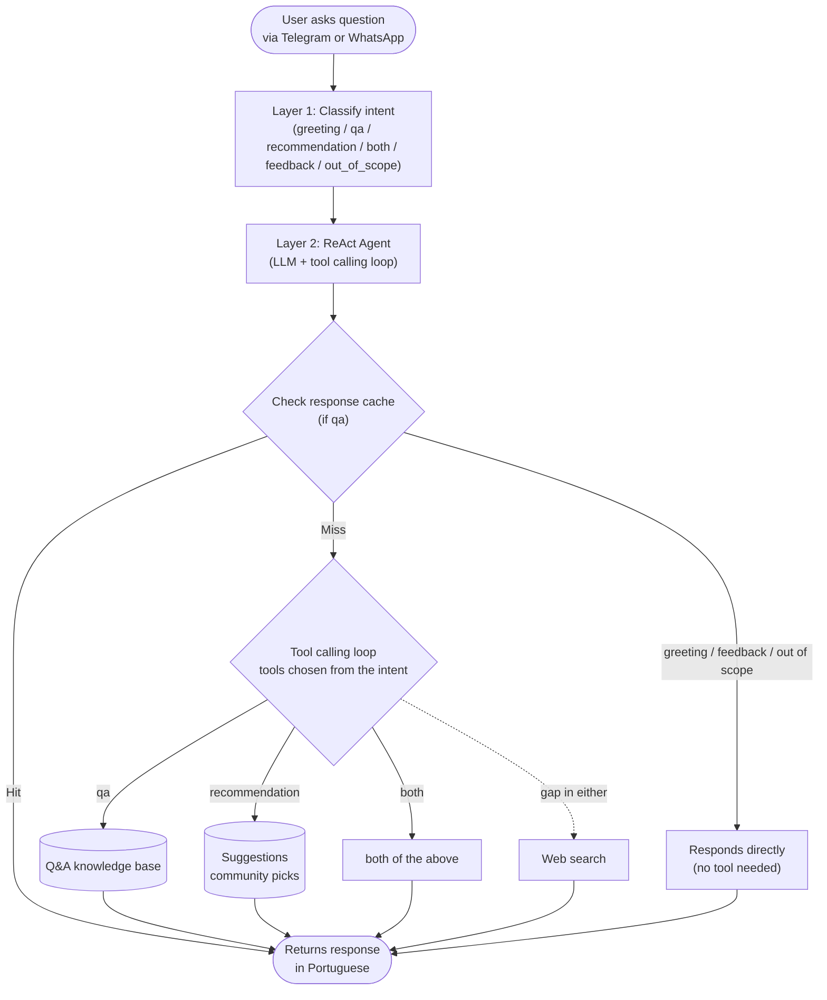

# Project Overview - Grenoble Brazilian Expats Chatbot

## 🎯 What is this?

An AI-powered chatbot that helps Brazilian expats in Grenoble, France navigate bureaucracy, housing, healthcare, and daily life questions. The bot centralizes knowledge from years of WhatsApp group conversations into an accessible, 24/7 assistant available on Telegram.

**Status**: MVP in development
**Launch Target**: Q1 2025
**Expected Users**: ~300 Brazilian expats in Grenoble

---

## 🤔 The Problem

Brazilian expats in Grenoble repeatedly ask the same questions in WhatsApp groups:
- *"Como renovar meu titre de séjour?"*
- *"Onde conseguir apartamento?"*
- *"Como marcar consulta médica?"*
- *"Qual banco abrir conta?"*
- *"Alguém indica um dentista?"*, *"Onde compro massa de pastel?"*

**Current pain points**:
- ❌ Information is fragmented across hundreds of chat threads
- ❌ Answers are buried in long conversations (Jan 2021 → Feb 2025)
- ❌ No easy way to search past discussions
- ❌ Information becomes outdated (bureaucracy changes)
- ❌ New arrivals ask the same questions repeatedly
- ❌ Group members get fatigued answering the same things
- ❌ Recommendations ("fui no X e gostei") are scattered over years, repeated by many people and spelled differently, so nobody can say how widely a place is trusted

**Impact**:
- Hours wasted searching or waiting for answers
- Missed deadlines (visa renewals, CAF applications)
- Frustration from outdated information
- Community fatigue

---

## ✨ The Solution

A **knowledge-based chatbot** that:

### What it does
1. **Answers questions instantly** - No waiting for someone online
2. **Searches historical knowledge** - 5 years of WhatsApp conversations indexed
3. **Provides reliable sources** - Links to official websites (préfecture, ANEF, CAF)
4. **Understands Portuguese** - Native language support
5. **Available 24/7** - Always ready to help
6. **Categorizes topics** - Visa, housing, healthcare, banking, transport, education, CAF
7. **Recommends who/where to go** - Businesses, places and products the community has recommended (dentists, hairdressers, markets, shops, translators...), with how many members recommended each, the date of the latest recommendation and a short reason

### How it works (simplified)

### Three kinds of question

| The user asks... | Intent | What the bot does |
|---|---|---|
| A how-to / informational question ("Como renovar meu titre de séjour?") | `qa` | Answers from the Q&A knowledge base, unchanged by Suggestions, with web search as backup |
| Who or where to go ("indicação de dentista", "onde compro massa de pastel?") | `recommendation` | Lists the community's picks from the Suggestions collection |
| Both in one message ("como traduzir meus documentos e qual tradutor vocês indicam?") | `both` | One reply with the procedure and the recommendations, clearly separated |

Which sources the bot can use is decided by the classified intent, not left to the model (see [ADR 0001](adr/0001-tools-chosen-from-classified-intent.md)), so a purely procedural question never sees recommendations.

### Example interaction

**User**: Como renovar meu titre de séjour passeport talent em Grenoble?

**Bot**:
> Para renovar seu **titre de séjour passeport talent** em Grenoble, você precisa:
>
> **Documentos necessários:**
> - Formulário CERFA preenchido
> - Passaporte válido
> - Comprovante de trabalho (contrat de travail)
> - Comprovante de residência
> - Fotos 35x45mm
>
> **Onde renovar:**
> Agendamento pelo site da ANEF (antiga préfecture):
> https://administration-etrangers-en-france.interieur.gouv.fr/
>
> **Prazo:**
> - Solicite 2-3 meses antes do vencimento
> - Tempo de processamento: 2-4 meses
>
> **Dica importante:** Vagas para agendamento são limitadas. Tente acessar o site logo cedo (antes das 9h) ou aos domingos à noite.
>
> 📎 *Baseado em experiências recentes da comunidade (Jan-Fev 2025)*

### Example: recommendation request

**User**: Onde compro massa de pastel?

**Bot** (shape of the reply; the names, counts and dates here are placeholders, not real data):
> A comunidade do grupo indicou estes lugares:
>
> - **<Nome do lugar A>** — 7👍/0👎, última menção 12/03/2026: massa de pastel e produtos brasileiros
> - **<Nome do lugar B>** — 3👍/1👎, última menção 02/11/2025: massa de pastel congelada
> - **<Nome do lugar C>** *(negócio de membro do grupo — divulgação própria)* — 2👍/0👎, última menção 20/01/2026
>
> São indicações da comunidade (um resumo das principais, não uma lista exaustiva). Confirme disponibilidade e horários antes de ir.

How recommendations behave:
- Each pick shows how many members recommended it (👍), how many did not (👎), the date of the latest mention and a short reworded reason. Messages are never quoted and authors are never named.
- Picks mentioned long ago count for less when ranking, so places that may have changed or closed rank lower.
- Negative opinions appear only as a count, never described; a place with more 👎 than 👍 is never offered.
- A business run by a group member is always labelled as such, and is only listed if it has a business identity (not just a member's name or number) and at least one other member recommended it.
- The list is short even when the group named dozens of places, and the bot says when others exist. A place named once for a specific item (e.g. polvilho) can still be found by that item's name.
- If nobody in the group recommended anything for the request, the bot says so and falls back to web search, kept clearly separate.
- Businesses can ask not to be listed, and members can ask for their messages to be removed; see [PRIVACIDADE.md](PRIVACIDADE.md).

---

## 👥 Who is this for?

### Primary Users
- **Brazilian expats in Grenoble** (current: ~300 people)
- **New arrivals** navigating French bureaucracy
- **Long-term residents** with occasional questions

---

## 🛠️ Tech Stack (high-level)

### Core Components
- **Interface**: Telegram and WhatsApp Bots
- **AI Models**:
  - OpenRouter / Gemini (answer synthesis)
  - OpenAI `text-embedding-3-small` (Dense embeddings, 1536-d)
  - `Qdrant/bm25` via `fastembed` (Sparse embeddings)
- **Knowledge Base**: Qdrant vector database with two collections: Q&A (Hybrid Search + RRF) and Suggestions (one point per Cluster of community recommendations)
- **Web Search**: Tavily API (Grenoble-scoped fallback)
- **Agent Architecture**: Two-Layer ReAct (LangChain tool calling)
- **Backend**: FastAPI (Python)
- **Deployment**: Low-cost VPS

### Data Sources
- WhatsApp group export (Jan 2021 - Feb 2025)
- ~5,000+ Q&A pairs extracted and curated
- Categorized by topic (visa, housing, healthcare, etc.)
- Community recommendations ("Suggestions"): businesses, places and products mentioned anywhere in the chat (including unprompted opinions that were never a question), consolidated into Clusters by kind of place and purpose
- Web Search: Tavily API for current/factual information

## 📚 Documentation

- **[ARCHITECTURE.md](ARCHITECTURE.md)** - Technical architecture, components, and implementation details
- **[IDEATION.md](IDEATION.md)** - Original problem definition and project scope
- **[../README.md](../README.md)** - Setup instructions, ingestion and the Suggestions pipeline
- **[../CONTEXT.md](../CONTEXT.md)** - Domain glossary
- **[PRIVACIDADE.md](PRIVACIDADE.md)** - Privacy notice (Portuguese)
- **[SUGGESTIONS_EVAL.md](SUGGESTIONS_EVAL.md)** - How extraction of Suggestions is measured
- **[adr/0001-tools-chosen-from-classified-intent.md](adr/0001-tools-chosen-from-classified-intent.md)** - Why tools come from the classified intent
- **DEPLOYMENT.md** *(coming soon)* - Production deployment guide

## 🎯 MVP Scope

### ✅ In Scope
- Telegram and WhatsApp bot interfaces
- Question answering (single-turn)
- Community recommendations (Suggestions) for "who/where do you recommend?" requests
- Portuguese language support
- 20 topic categories
- Source attribution
- Basic feedback (thumbs up/down)
- Knowledge bases from WhatsApp history: Q&A Pairs and Suggestions

### ❌ Out of Scope (for now)
- Multi-turn conversations with memory persistence
- User personalization
- Real-time knowledge updates
- Admin dashboard
- Multi-language support
- Voice messages
- Image understanding

---

## 💰 Cost Structure

**Target**: <$30/month total

| Component | Monthly Cost | Notes |
|-----------|--------------|-------|
| VPS (Hetzner CPX11) | $5-8 | 2 vCPU, 4GB RAM |
| OpenRouter API | $2-5 | ~1M tokens/month estimate |
| Domain (optional) | $1 | For webhook URL |
| **Total** | **~$8-14** | Scales with usage |

**Cost optimization strategies**:
- Use Gemini (highly cost-effective via OpenRouter)
- Implement response caching for repeated questions
- Rate limit Telegram bot to prevent spam expenditure
- Limit response length (max_tokens: 1024)
- Cheap embeddings (OpenAI `text-embedding-3-small`; sparse BM25 runs locally)

---

## 📈 Roadmap

### Phase 1: MVP (Current)
- Core Q&A functionality
- Telegram and WhatsApp interfaces
- 5 super users
- 20 categories

### Phase 2: Refinement (Q3 2025)
- Multi-turn memory
- Improved search quality
- Knowledge base updates

### Phase 3: Scale (Q4 2025)
- Other Brazilian expat communities (Paris, Lyon, Toulouse)
- Portuguese expats
- Admin dashboard
- Automated content updates

### Future Ideas
- Voice message support
- Image understanding (documents, screenshots)
- Proactive notifications (visa expiration reminders)
- Integration with official APIs (CAF, préfecture)
- Mobile app (React Native)

---

**Last Updated**: March 2025
**Version**: 0.1.0 (Pre-MVP)
