# Eval-Driven Prompt Improvement Guide

A repeatable playbook for improving the agent's prompt/tool-selection behavior using
`golden_dataset_v2.json` as the feedback loop. Written after the 2026-07 round that
took `kb_web` from 40%→80% real pass rate and `web` from 66.7%→100% (see
`tests/eval/checkpoints/` for that round's full trail — baselines, every intermediate
report, and the probe scripts referenced below). Use this guide the next time there
are new golden-dataset questions or a new capability gap to close.

## Flow overview

```mermaid
flowchart TD
    A["1. Baseline run<br/>full suite + save checkpoint<br/>(prompt/tool files + report_v2.json)"] --> B

    subgraph DIAG["Diagnose"]
        B["2. Diagnose root cause<br/>debug_single_question.py on failing cases<br/>code-driven or prompt-driven?"]
    end
    B --> C["3. Form minimal, targeted hypothesis<br/>(fix the root cause, not the case ID)"]

    subgraph FAST["Fast iteration loop (cheap, run often)"]
        C --> D["4. Isolated test<br/>run_isolated.py &lt;target case ids&gt;"]
        D --> E{Target cases<br/>pass?}
        E -- No --> C
        E -- Yes --> F["Guard sample<br/>1 kb case/category + all none cases"]
        F --> G{Regressions in<br/>guard sample?}
        G -- Yes --> C
    end

    G -- No --> H

    subgraph OVERFIT["5. Anti-overfitting check (mandatory)"]
        H["Write held-out probes:<br/>same trigger, new topic/wording<br/>+ distractors (should NOT trigger)"]
        H --> I["Run probes: before (git stash)<br/>vs after (restored)"]
        I --> J{Generalizes on probes<br/>AND distractors still safe?}
        J -- No, memorized/over-triggers --> C
    end

    J -- Yes, real behavior change --> K

    subgraph VALIDATE["Validation (expensive, run once at the end)"]
        K["6. Full 67-case run<br/>run_eval.py --dataset golden_dataset_v2.json"]
        K --> L["Compare by_bucket vs baseline"]
        L --> M["Spot-check flipped cases' actual<br/>answer text, not just PASS flag"]
        M --> N{Metric false positive?<br/>paraphrase dodged a<br/>substring check, etc.}
        N -- Yes --> O["Report true behavior honestly;<br/>consider fixing metrics.py"]
        N -- No --> P["7. pytest tests/ -v"]
        O --> P
        P --> Q{Failures?}
        Q -- Yes --> R["git stash -> rerun -><br/>confirm pre-existing or caused by change"]
        Q -- No --> S
        R --> S
    end

    S["8. Write checkpoint/report<br/>honest caveats, not just headline number"] --> T(["Done — ready for review"])

    style A fill:#e8f0fe,stroke:#4285f4
    style T fill:#e6f4ea,stroke:#34a853
    style O fill:#fef7e0,stroke:#f9ab00
    style E fill:#fce8e6,stroke:#ea4335
    style G fill:#fce8e6,stroke:#ea4335
    style J fill:#fce8e6,stroke:#ea4335
    style N fill:#fce8e6,stroke:#ea4335
    style Q fill:#fce8e6,stroke:#ea4335
```



Every red diamond is a real decision point from last round — e.g. the `J` check (held-out
probes) is what caught the train-specific example only generalizing to train questions
(step 5 in the walkthrough below), and the `N` check (metric spot-check) is what caught
`travel-kbweb-01`'s PASS being a paraphrase dodging a substring check rather than a real
fix (step 6). Both loops (`FAST` and back-edges out of `OVERFIT`/`VALIDATE`) return to
step 3 — this is meant to be iterative, not a straight line.

## Scope — what you're allowed to touch

This loop is for **prompt-level and deterministic-code fixes only**:
- `api/src/habitantes/domain/prompts/*.py` (system prompts)
- `api/src/habitantes/domain/tools/*.py` **docstrings only** — these are read by
  `bind_tools()` as the LLM-facing tool description, so wording changes are prompt
  engineering, not orchestration logic. Never change a tool's control flow here.
- `api/src/habitantes/eval/metrics.py` / `tests/eval/run_eval.py` — only if a metric
  itself is diagnosed as broken (see step 6 below for how that showed up last round).

Do **not** touch `agent.py` control flow, `state.py`, API contracts, or ingestion as
part of this loop — those are architecture changes with their own review path
(Tech Architect), not prompt iteration. If diagnosis points there, stop and raise it
as a separate design discussion instead of patching around it in the prompt.

**Golden dataset changes are last resort.** A case that keeps failing might be
mis-specified, but only reach for that after ≥2 genuine prompt attempts, and check
`tests/eval/README_v2.md` first — a case's `notes` field often explains it's
*supposed* to be hard (`test_type: capability`), which isn't the same as being wrong.

## Tooling

| Tool | Use for |
|---|---|
| `python tests/eval/run_eval.py --dataset tests/eval/golden_dataset_v2.json` | Full 67-case run. Writes `report_v2.json`. Slow (real LLM + judge calls) — run only at the start (baseline) and end (final validation) of a round, not per-edit. |
| `python tests/eval/checkpoints/run_isolated.py <id> [<id> ...]` | Runs specific case IDs from `golden_dataset_v2.json` through the same grading logic (`run_case_v2`), without the 67-case cost. This is your fast iteration loop. |
| `python tests/eval/checkpoints/debug_single_question.py "question"` | Runs one arbitrary question (not necessarily a dataset case) through the full agent and dumps intent, answer, sources, and raw KB chunks. Use this to root-cause *why* a case fails before touching the prompt. |
| `python tests/eval/checkpoints/probe_generalization.py` | Held-out generalization check — see step 5. Edit `PROBES` before running for a new round. |

All of these need `uv run python ...` (not a bare `python`) and — if your shell has a
stale `VIRTUAL_ENV` pointing outside the project — `unset VIRTUAL_ENV` first, or `uv`
will warn and may resolve the wrong environment.

## The loop

### 1. Establish baseline
Run the full suite, save the report and the current prompt/tool files before touching
anything:
```
cp api/src/habitantes/domain/prompts/synthesis.py tests/eval/checkpoints/synthesis.vN.baseline.py
cp api/src/habitantes/domain/tools/web_search.py tests/eval/checkpoints/web_search.vN.baseline.py
python tests/eval/run_eval.py --dataset tests/eval/golden_dataset_v2.json
cp tests/eval/report_v2.json tests/eval/checkpoints/report_v2.vN.baseline.json
```
Read `report_v2.json`'s `by_bucket` and `by_category` tables, not just the top-line
number — a blended pass rate hides which bucket is actually weak.

### 2. Diagnose — read the code, not just the prompt
For each failing case, look at `report_v2.json`'s `cases[]` entry (keyword_coverage,
semantic_similarity, `used_web_source`, `contains_stale_fact`, etc. — see
`README_v2.md` for what each bucket grades on) and, if the numbers don't explain it,
run `debug_single_question.py` with the exact question to see the raw retrieved
chunks and whether the web tool actually fired.

Critically: check whether the failure is prompt-driven or code-driven. Last round's
example — `agent.py`'s only code-level nudge toward `web_search_grenoble` fires when
KB retrieval returns *zero* relevant chunks (see `agent.py` around the
`web_available and not web_attempted` branch). If KB retrieval returns something
that clears the relevance floor, whether to double-check via web is **entirely
prompt-driven** — no amount of squinting at retrieval tuning will fix it; the fix has
to be in the system prompt's tool-selection language.

Group failures by root cause, not by case ID — several failing cases are often the
same underlying gap (last round: 3 separate `kb_web` failures were all "the KB chunk
looks confident and complete, so the model never double-checks it," regardless of
topic).

### 3. Form a minimal, targeted hypothesis
Write the smallest prompt change that addresses the root cause, not the individual
case. If your first draft only makes sense with the exact wording of one failing case
in mind, that's a warning sign — see step 5.

### 4. Test in isolation, iterate fast
```
python tests/eval/checkpoints/run_isolated.py <failing-id-1> <failing-id-2> ...
```
Note: the agent runs at `temperature=0` (`settings.agent.temperature`), so results are
deterministic — if a case flips between two runs with no prompt change, something
else changed (retrieval non-determinism, a stale cached client, etc.), not the model
being "random."

After a fix lands, **also re-run a guard sample** of currently-passing cases spanning
categories/buckets you didn't target, to catch collateral regressions before paying
for a full run. A reasonable guard sample: one `kb` case per category (~19 cases),
plus all `none` cases (~10) — cheap relative to the full 67, and catches most
collateral damage. Example:
```
python tests/eval/checkpoints/run_isolated.py bank-basic-01 daily-basic-01 docs-basic-01 \
  food-basic-01 hair-basic-01 health-basic-01 housing-basic-01 integ-basic-01 \
  market-basic-01 safety-basic-01 nightlife-basic-01 pets-basic-01 phone-basic-01 \
  ski-basic-01 sports-basic-01 travel-basic-01 univ-basic-01 visa-basic-01 work-basic-01 \
  neg-oos-01 neg-oos-02 neg-oos-03 neg-oos-04 neg-oos-05 \
  neg-empty-01 neg-empty-02 neg-empty-03 neg-empty-04 neg-empty-05
```
(Regenerate the category list with `python3 -c "import json; ..."` over
`golden_dataset_v2.json` if the dataset has grown — don't assume this exact ID list is
still current.)

### 5. Check for overfitting — do this before declaring victory, not after

**This step is not optional.** A prompt tuned directly against the exact failing
questions can pattern-match those questions' specific facts/wording instead of
generalizing the underlying behavior. It will look perfect on `run_eval.py` and still
fail in production on the first slightly-different question a real user asks.

Method:
1. Write 4-6 **held-out probes**: genuinely new questions, never in
   `golden_dataset_v2.json`, covering the *same triggers/categories* you just changed
   but with different concrete topics (different bank, different transport route,
   different visa document, etc.). Add 1-2 **distractors** — cases that superficially
   resemble the trigger but where the new behavior should *not* fire (e.g. a price
   question with no official/authoritative source to verify against) — to catch
   harmful over-triggering, not just under-triggering.
2. `git stash` your prompt change, run the probes, save the output (this is the
   "before" — usually similar to whatever the baseline behavior was).
3. Restore your change, run the same probes again (the "after").
4. Compare by hand. A real fix improves the held-out probes noticeably, without
   crippling the distractors. A memorized fix looks unchanged (or only marginally
   better) on the held-out probes despite looking perfect on the dataset.

Template: `tests/eval/checkpoints/probe_generalization.py` (edit `PROBES` for your
round, per the instructions in its docstring).

**What last round found, worth remembering**: a first-draft fix used a worked example
in the prompt (`EXEMPLO: ...`) that was concretely about the exact failing case's
topic (a train schedule question, because that's what motivated the fix). The held-out
probes showed this only generalized to train-shaped questions — a paraphrased
transport question on a *different* route still didn't trigger the fix. Rewriting the
example to describe the pattern **abstractly** (a value/rule stated with confidence,
no verification date — without naming trains, or any concrete topic) made the held-out
probes pass *and* improved the literal dataset pass rate further. Counterintuitive,
but the lesson is: a worked example that's concrete about the *mechanism* generalizes;
one that's concrete about the *topic* doesn't. Prefer abstract examples unless you have
evidence a concrete one is needed.

### 6. Run the full suite once, and sanity-check the metric itself

Once isolated + guard-sample + held-out probes all look right, run the full suite once
for final validation:
```
python tests/eval/run_eval.py --dataset tests/eval/golden_dataset_v2.json
```

**Do not trust a bucket flipping to 100% at face value without spot-checking at least
one case's actual answer text.** Deterministic metrics like `contains_stale_fact`
(substring match against `stale_fact_markers`) are brittle to paraphrase. Last round,
a broadened prompt trigger changed a stale claim's *phrasing* ("apenas durante o
inverno" → "Durante o inverno: ... Fora do inverno: ...") without changing the
underlying behavior (still no web call, still the same stale fact) — enough to dodge
the substring check and flip the case to PASS. Caught by re-running
`debug_single_question.py` on that exact case and reading the answer, not by trusting
the pass/fail flag. If you find this, don't quietly accept the inflated number —
report the true, behaviorally-verified state, and consider whether the metric itself
needs a semantic (LLM-judge) check instead of a substring one (in scope to fix per the
Scope section above, since it's `metrics.py`, not the golden dataset).

Also compare the full run's `by_bucket` and `gate_results` against your baseline
snapshot from step 1 to confirm nothing outside your target buckets regressed.

### 7. Run pytest
```
python -m pytest tests/ -v
```
If something fails, check whether it's pre-existing before assuming you caused it:
`git stash`, rerun the specific failing test, `git stash pop`. Last round two
integration tests failed on a dummy API key in the pytest environment — reproduced
identically with all prompt changes stashed out, confirmed unrelated.

### 8. Write it down
Update (or create fresh, per round) a checkpoint file capturing: baseline numbers,
root-cause diagnosis, each iteration's change and why, the held-out probe results, the
final numbers with **honest caveats** (per step 6), and pytest status. This is what
lets the next round (or a different person) pick up context without re-deriving
everything. See `tests/eval/CHECKPOINT.md` from this round as a template — it's kept
as a worked example rather than reset, so you can see the actual before/after
reasoning trail.

## Adding new questions to the dataset

Follow the schema in `tests/eval/README_v2.md` (`id`, `category`, `question`,
`difficulty`, `test_type`, `expected_source`, `expected_thread_ids`,
`expected_answer_keywords`, `ground_truth_answer`, `grounded_in`, `notes`, and
`stale_fact_markers` for `kb_web` cases). Key points that are easy to get wrong:
- `test_type: regression` means "should ~always pass" — only use it for cases you're
  confident are genuinely basic; a hard case mislabeled `regression` will gate the
  build on something that's supposed to be a capability measurement.
- `kb_web` cases need a *real* stale-vs-current fact pair, verified independently
  (not just assumed) — cite both the KB thread and the live source in `grounded_in`.
- Every new case needs `grounded_in` provenance that's re-derivable later — don't add
  a case whose correctness can't be re-checked in six months.
- Get a second pass on new cases before trusting them as gates, the same way this
  round's 67 cases were reviewed (`golden_v2_review.md`) before being wired into
  `run_eval.py`.

## Quick-reference checklist

- [ ] Baseline run + files copied to `tests/eval/checkpoints/`
- [ ] Failures diagnosed by root cause (code vs. prompt), not just by case ID
- [ ] Minimal targeted prompt/docstring fix drafted
- [ ] Isolated test on target cases passes
- [ ] Guard sample (1/category `kb` + all `none`) shows no regressions
- [ ] Held-out probes written and compared before/after — real generalization, not
      memorization; distractors confirm no harmful over-triggering
- [ ] Full 67-case run — compared bucket-by-bucket against baseline
- [ ] At least one flipped case's actual answer text spot-checked (not just the
      pass/fail flag) — metrics can produce false positives
- [ ] `pytest tests/ -v` — any failures confirmed pre-existing via `git stash`
- [ ] Checkpoint/report written with honest caveats, not just the headline number
